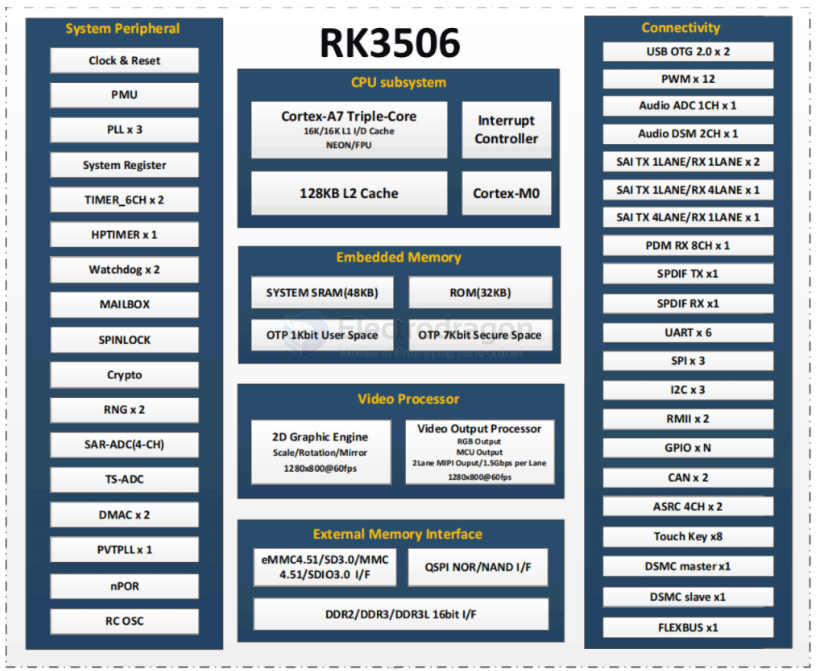

# RK3506-dat

RK3506 is a system-on-chip (SoC) that integrates A7 and M0 cores for smart IoT devices. It has multiple functions and rich interfaces, supports Linux operating system, and is suitable for a variety of application scenarios, such as smart home, building intercom, PLC and other AIoT solutions. The following is a chip introduction of RK3506, which is convenient for customers to select and define products.

System Peripherals
- CPU Subsystem: Cortex-A7 three-core processor with NEON/FPU support, providing high-performance computing capabilities.
- Clock and reset: Contains multiple PLLs (phase-locked loops) for clock management.
- Interrupt controller: used to handle system interrupts.
- System registers: used to configure and control chip behavior.

Connectivity
- USB OTG 2.0: Provides two USB OTG 2.0 interfaces to support high-speed data transmission.
- Ethernet: Has SAI TX/RX multi-channel interface for network connection.

Audio Processing
- Audio ADC: 1-channel audio analog-to-digital converter.
- AudioDSM: 2-channel audio digital signal processor.
- PDM RX: 8-channel pulse density modulation receiver.

Video Processing
- 2D Graphics Engine: Supports graphics rendering.
- Video Output Processor: Supports multiple video output formats.
- MIPI Output: Supports dual-channel MIPI output, 1.5Gbps per channel.

Storage and Memory
- System SRAM: 48KB system random access memory.
- ROM: 32KB read-only memory.
- OTP: One-time programmable memory with 1Kbit user space and 7Kbit security space.

Operating System
- Linux 6.1 SDK Alpha Version

 Main Functions:
- Supports Buildroot system build.
- Supports multiple file system types, including EXT2/3/4, VFAT, NTFS, UBIFS, SquashFS.
- Supports OTA, AB, Recovery and other upgrade recovery methods.
- Supports SecureBoot secure boot.
- Provides ROCKCHIP_TEST stress test tool.
- Supports data communication methods such as Wi-Fi, Ethernet card, USB, SD card, etc.
- Supports home appliance display control UI display and video playback applications.

Other Features
- GPIO: Programmable input and output interface.
- CAN: Two CAN bus interfaces.
- ASRC: 4-channel audio sampling rate converter.
- DMAC: Two direct memory access controllers.
- External storage interface: Supports storage interfaces such as eMMC, SD/MMC, and QSPI.