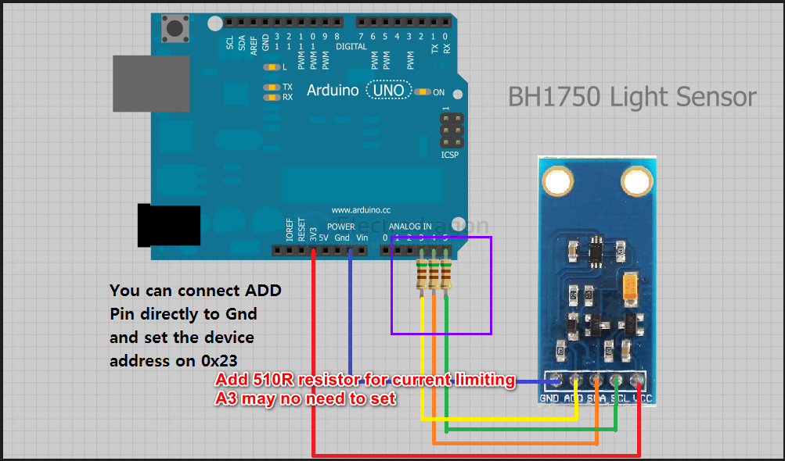

# BH1750FVI-dat

Digital 16bit Serial Output Type Ambient Light Sensor IC

## Specifications 

1) Illuminance to Digital Converter
2) Wide range and High resolution. ( 1 - 65535 lx )
3) Low Current by power down function
4) 50Hz / 60Hz Light noise reject-function
5) I2C bus Interface ( f / s Mode Support )
6) No need any external parts
7) It is possible to select 2 type of I2C slave-address.
8) It is possible to detect min. 0.11 lx, max. 100000 lx by using this function.

## Setup 

Supply voltage : prefer to use 3.3 V to communicate with , Not 5V TTL Logic 

I2C Protocol is used to communicate with Microcontroller , with clock SCL Frequency 400KHz .

Measurement mode: this sensor has 3 Measurement mode :

1) H-resolution with Sensitivity 0.5 lux
2) H-Resolution with Sensitivity 1 lux.
3) L-Resolution with Sensitivity 4 lux.

I2C address == 0x23 or 0x5C

## demo code 

https://github.com/Genotronex/BH1750FVI_Master

- arduino code - [[BH1750FVI-ard.ino]]
