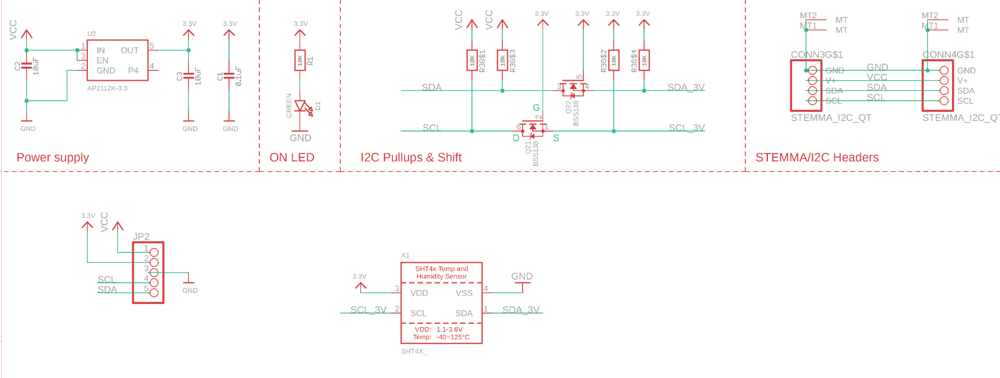

# SHT4x-dat

The **SHT40** has an excellent ±1.8% typical relative humidity accuracy from 25 to 75% and ±0.2 °C typical accuracy from 0 to 75 °C.

The **SHT41** has an excellent ±1.8% typical relative humidity accuracy from 25 to 75% and ±0.2 °C typical accuracy from 0 to 75 °C.

The **SHT45** has an even more excellent ±1% typical relative humidity accuracy from 25 to 75% and ±0.1 °C typical accuracy from 0 to 75 °C. 

| Sensor Model | Relative Humidity Accuracy (25–75%) | Temperature Accuracy (0–75 °C) |
|--------------|-------------------------------------|---------------------------------|
| **SHT40**    | ±1.8%                              | ±0.2 °C                        |
| **SHT41**    | ±1.8%                              | ±0.2 °C                        |
| **SHT45**    | ±1%                                | ±0.1 °C                        |

## SCH 

## ref 

- [[Sensirion_Datasheet_SHT4x.pdf]] 
- [[SHT40-PCB-main.zip]]