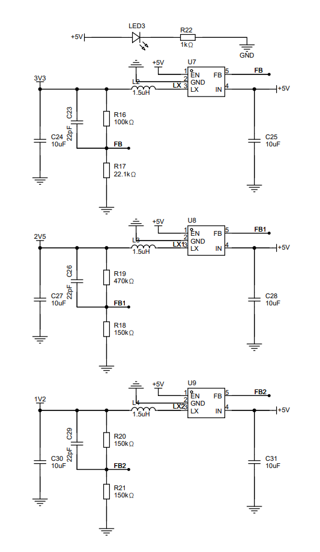
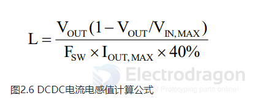
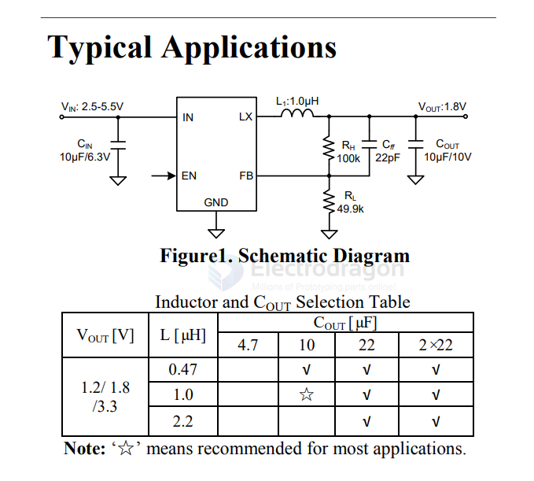
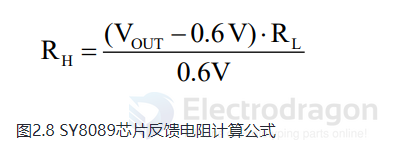

# SY8089-dat

该部分主要为主控芯片提供供电，采用SY8089A1AAC，单路最大输出电流2A，

如图，其中C24/C25/C27/C28/C30/C31为DCDC输入/输出滤波电容，L2/L3/L4为相应的电感，R16/R17/R18/R19/R20/R21为DC-DC反馈电阻，用于调节芯片输出电压，EN引脚为芯片使能脚，高电平有效，由于F1C200S对上电时序没有要求，故本开发板直接连接到电源输入，这样上电之后，芯片会直接开始运行，输出电压。

在该模块中，我们使用了2520电感，与普通的电感相比，体积更小，但是2520电感在DCR（即直流电阻）参数上，会比普通的电感大一点，电感值的计算公式可以参考下方：

图2.6 DCDC电流电感值计算公式

其中：

L为计算出的电感容量

Vout为降压芯片输出电压

Vin为降压芯片输入电压

Fsw为芯片开关频率，SY8089取1.5Mhz，也就是1500000Hz

Iout,max为最大输出电流

如下图所示，本开发板电感值直接参考SY8089数据手册文档，折中后取1.5Uh：

图2.7 SY8089典型应用以及电容电感选型表

芯片的反馈电阻控制着芯片的输出电压，可以参考下方公式计算：

图2.8 SY8089芯片反馈电阻计算公式

其中：

Rh为上端分压电阻阻值

Rl为下端分压电阻阻值

0.6V指的是芯片的Vfb，也就是反馈电阻

Vout即最终的电压输出值

在这里，我们需要确定Rl和Vout，然后将其代入公式，计算出Rh。

为了最大限度地减少轻负载下的功耗，最好为 RH 和 RL 选择较大的电阻值。强烈建议 RL 使用 10k 到 200k 之间的值。