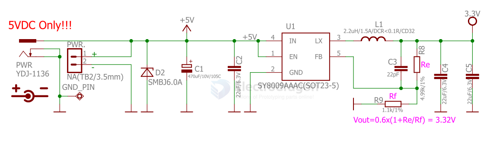

# silergy-dat

- [[SY8205-dat]] - [[OPM1192-dat]] - [[silergy-dat]]

- [[SY8120-dat]]

- [[SY6280-dat]] == [[OCP-dat]] - [[SC-dat]] - [[power-protection-dat]]

- [[DCDC-down-dat]]

- [[LDO-dat]] - [[SY2A27357A-dat]] - [[silergy-dat]]

## SY8009 

High Efficiency 1.5MHz/1MHz, 1.5A/2A Synchronous Step Down Regulator

## ref 

