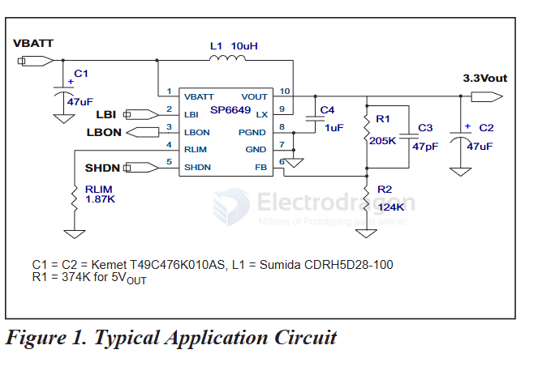

# SP6649-dat

- [[SP6649-dat]] - [[sipex-dat]] - [[dcdc-boost-dat]]

datasheet == [[SP6649.pdf]]

Ultra-low Quiescent Current, High Efficiency Boost DC-DC Regulator

The SP6649 is an ultra-low quiescent current, high efficiency step-up DC-DC converter ideal for single and dual cell alkaline, or Li-Ion battery applications such as digital still cameras, PDA’s, MP3 players, and other portable devices. The SP6649 combines the high delivery associated with PWM control, and the low quiescent current and excellent light-load efficiency of PFM control. 

The SP6649 features 12μA quiescent current, synchronous rectification, a 0.3  charging switch, anti-ringing  inductor  switch,  programmable  low  battery  detect,  under-voltage  lockout  and programmable  inductor  peak  current.  The  device  can  be  controlled  by  a  1nA  active  LOW shutdown pin.

FEATURES
- UItra-low 12μA Quiescent Current  700mA Output Current at 2.6Vin, 3.3VouT1 94% Efficiency Posible
- Wide Input Voltage Range: 0.85V to 4.5V
- 3.3V Fixed Output and adjustable 2.5V to 5.0V Output Range
- Internal Synchronous Rectifier for High Effiency
- 0.3 Charging Switch, 0.3 Synchro-nous Rectifier
- Anti-Ringing Inductor Switch
- 1 Programmable Inductor Peak Current 1 Logic Shutdown Control
- Under Voltage Lock-Out, 0.62V1 Programmable Low Battery Detect 1 Small 10 pin MSOP Package

## ref 

