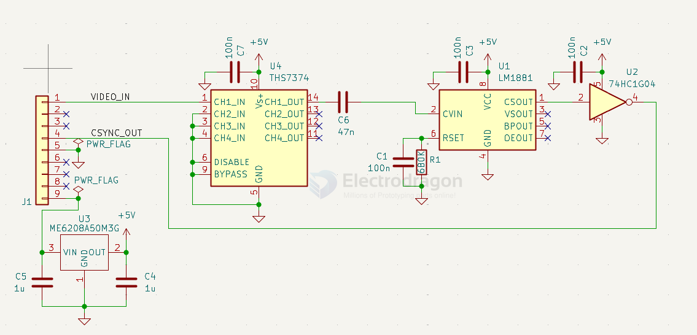

# TA7357-dat

- [[TA7357-dat]] - [[toshiba-dat]] - [[chip-dat]]

The TA7357P is an obsolete Toshiba integrated circuit used as a video sync separator, commonly found in professional broadcast equipment like Sony Betacam SP video tape recorders.

The main parts are: `THS7374` video amplifier, `LM1881` sync separator, `74HC1G04` inverter, and `ME6208` 5 V regulator.

- [[logic-inverter-dat]] - [[logic-dat]] - [[LDO-dat]]

- [[amplifier-video-dat]] - [[THS7374-dat]] - [[amplifier-dat]]

## SCH 

## pins 

Original Pinout:
- 1 - Video input
- 2 - Ripple filter passives
- 3 - Sync sep passives
- 4 - Sync sep output
- 5 - GND
- 6 - NC
- 7 - HD Gen passives
- 8 - HD Gen output
- 9 - Vcc (+9V)

## ref 

