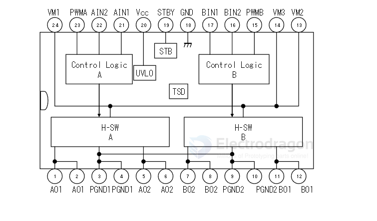

# TB6612-dat

- [[TB6612FNG.pdf]]

- [[SDR1059-dat]]

- [[motor-driver-dat]]

## Features 

- Single channel continuous drive current 1.2A
- Single channel maximum peak current 3.2A
- Input power supply range 5.5-15V
- Protection functions: **short circuit protection, over-temperature protection**
- Other functions: power supply voltage sampling, encoder interface
- Control signal pins: to control one motor's forward and reverse rotation, 1 PWM channel and 2 general IOs are needed
- Logic or reference power supply range: no logic power supply needed, reference voltage uses the built-in regulated 5V output
- Function: can simultaneously drive 4 motors for forward/reverse rotation with stepless speed regulation, **PWM dead zone is much smaller than L298N**

## Chip pins 

## breakout board schematic 

- [[power-protection-dat]]

## tutorial 

- [How to use TB6612 with arduino](http://www.embeddedrelated.com/showarticle/498.php)

## Real-world power dissipation considerations

The TB6612 motor driver used on the carrier board has **a peak current rating of 3 A per channel**. The peak ratings are for quick transients (e.g. when a motor is first turned on), and the continuous rating of 1 A is dependent on various conditions, such as the ambient temperature.

The actual current you can deliver will depend on how well you can keep the motor driver cool. The carrier’s printed circuit board is designed to draw heat out of the motor driver chip, but performance can be improved by adding a heat sink.

## ref 

- [[dcdc-down-dat]]

- [[toshiba-dat]] - [[TB6612]]

