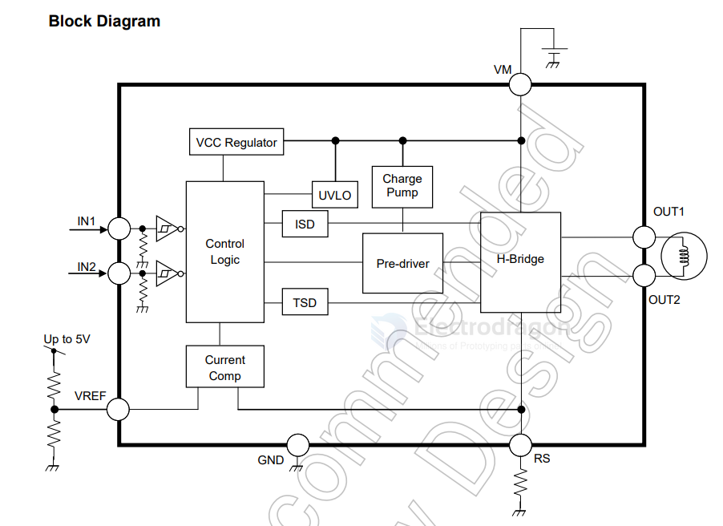

# TB67H450-dat

- [[PWM-chopper-type-motor-driver]]

PWM Chopper Type DC Brushed Motor Driver

The TB67H450FNG is a PWM chopper type DC brushed motor driver.
One channel of motor output block is embedded.
Fabricated with the BiCD process, the TB67H450FNG is rated at output
voltage 50 V, maximum current 3.5A.

## Features
-・ Monolithic IC using BiCD process
-・ Capable of PWM constant current drive and direct PWM drive
-・ Supporting 4 operation modes, Forward / Reverse / Brake / STOP (OFF)
-・ Built-in output MOSFET with Low on-resistance (High side + low side=0.6Ω(typ.))
-・ Realization of high voltage and large current drive (Refer to “Absolute maximum ratings” and “Operating range”.)
-・ Built-in various error detection functions (Thermal shutdown (TSD), over current detection (ISD), and Under voltage
-lockout(UVLO))
-・ Built-in VCC regulator for the internal circuit operation

## application 

## Vref 

- With VREF left **open** / **no voltage applied** → the TB67H450 cannot supply current (limit = 0).
- If the constant current control function is **disabled**, the RS pin should be connected to **GND**, and the voltage (1 to 5V) is input to VREF pin.

## pins are TTL/CMOS compatible

IN1 and IN2 are TTL/CMOS compatible.

A 3.3 V logic HIGH is safely above the 2.0 V threshold → so 3.3 V works fine.

A 5 V logic HIGH is also allowed (since VIN max is 6 V) → so 5 V is also fine.

## ref 

- [[toshiba-dat]]