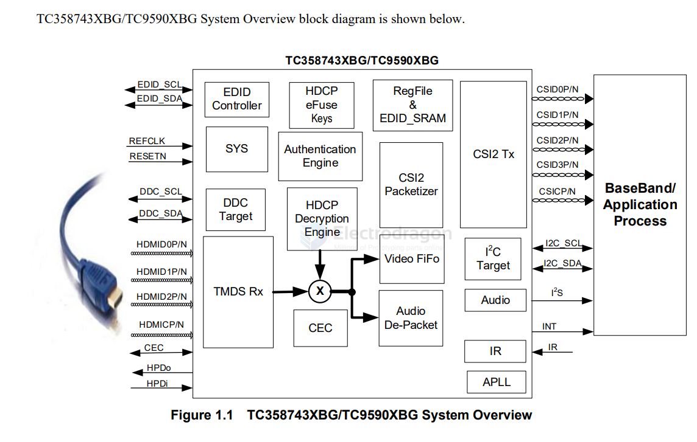

# TC358743-dat

- [[toshiba-dat]] - [[TC358743-dat]]

- [[HDMI-dat]] - [[camera-CSI-dat]] - [[interface-dat]] - [[MIPI-dat]] - [[video-dat]]

Overview

The HDMI®-RX to MIPI® CSI-2®-TX is a bridge device that converts HDMI stream to MIPI CSI-2 TX.

The current and next generation Application Processors and Baseband chips have been designed without video streaming input port except CSI-2 for Camcorder input. Smart Phone Processors are being used in several applications that required Video Input TC358743XBG/TC9590XBG takes in HDMI input and converts to CSI-2 that looks like a Camcorder input.

## diagram 

## ref 

