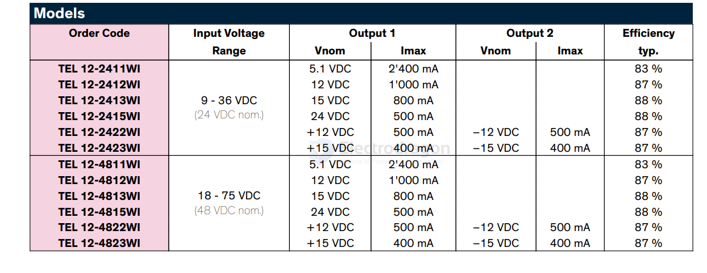

# traco-power-dat

- [[dcdc-down-dat]] 

THN-30-2423 - Isolated DC/DC Converters - Through Hole 30W

TEL 12WI Series, 12 Watt

The TEL 12WI is a 12 Watt DC/DC converter series which comes in an ultra compact DIP-16 metal package. The design purpose was to miniaturized low power DC/DC converters to the maximum without sacrificing high efficiency.

https://www.tracopower.com/tel12wi-datasheet