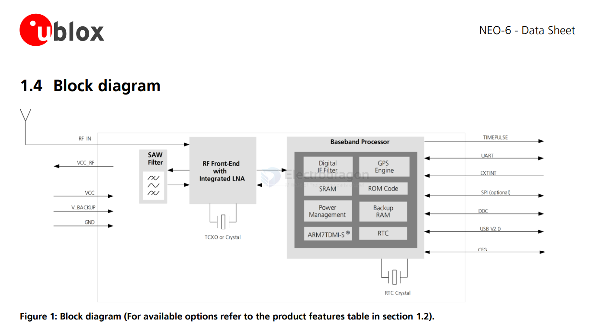
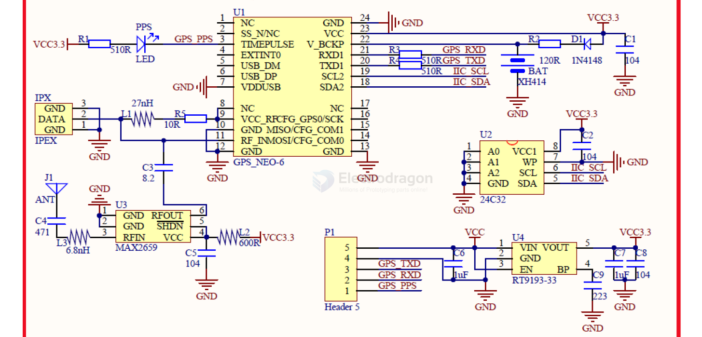
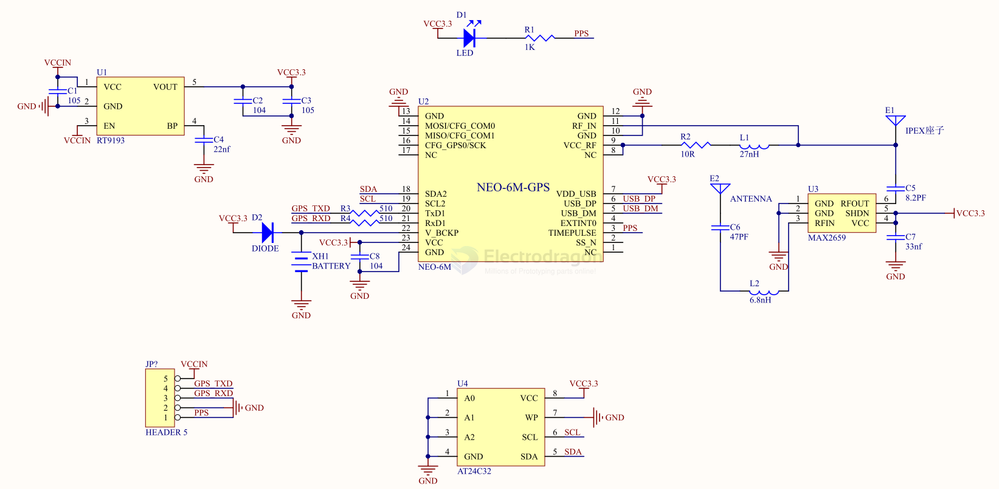

# NEO-6-dat.md

- [[NEO-6-dat]] - [[NEO-7-dat]] - [[NEO-8-dat]] - [[u-blox-dat]]

- [[location-dat]] - [[GNSS-dat]] - [[GPS-dat]] - [[nema-dat]]

https://content.u-blox.com/sites/default/files/products/documents/NEO-6_DataSheet_%28GPS.G6-HW-09005%29.pdf

## NEO-6M

- [[NGS1052-dat]]

- [[MPC1056-dat]]

## NEO-6M GPS Module

The NEO-6M is a compact and efficient GPS receiver module from [[u-blox-dat]]. It's widely used in various applications requiring accurate positioning and navigation.

**Key Features:**

*   **High Sensitivity:** Excellent performance even in weak signal environments.
*   **Low Power Consumption:** Suitable for battery-powered applications.
*   **Compact Size:** Easy integration into small devices.
*   **UART Interface:** Simple communication with microcontrollers.
*   **Accurate Positioning:** Provides precise location data.
*   **Easy to Use:** Well-documented and supported.
*   

## SCH

- [[MAX2659-dat]] - [[RF-amplifier-dat]]

SCH 2 

## ref 

- [[u-blox-dat]]