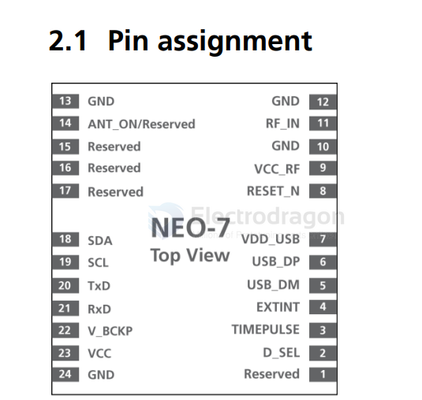
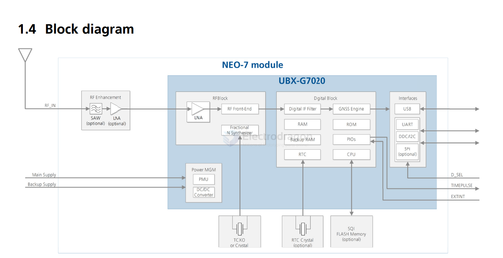
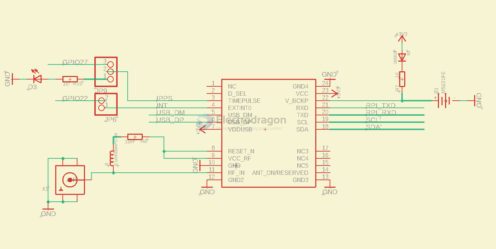

# NEO-7-dat.md

## board 

- [[NGS1052-dat]]

- [[MPC1056-dat]]

## info 

https://content.u-blox.com/sites/default/files/products/documents/NEO-7_DataSheet_%28UBX-13003830%29.pdf

- 15.9 x 12.1 

- DDC Data if D_SEL =1 (or open)
- SPI Chip Select if D_SEL = 0

## function diagram 

## wiring with RPI

## ref 

- [[NEO-6-dat]] - [[NEO-7-dat]] - [[NEO-8-dat]] - [[u-blox-dat]]

- [[location-dat]] - [[GNSS-dat]]

