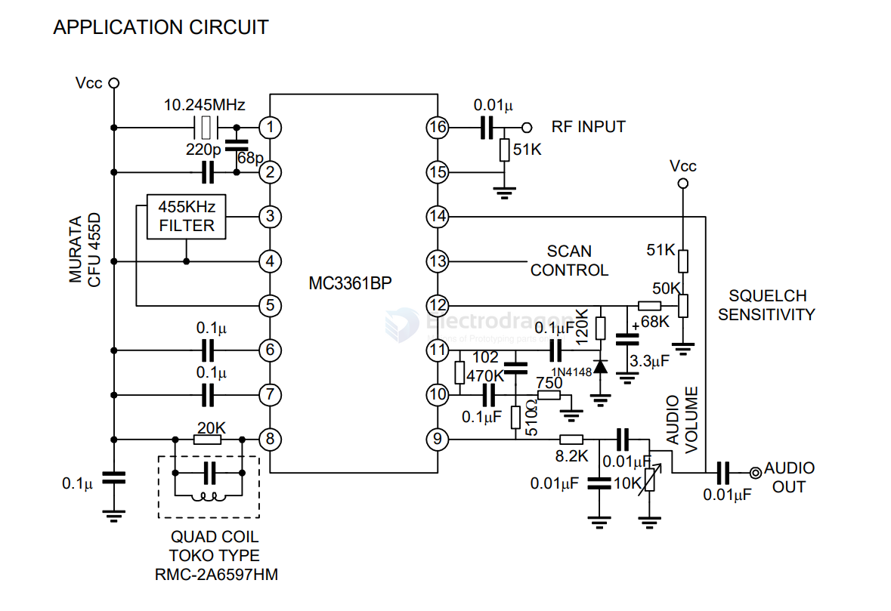
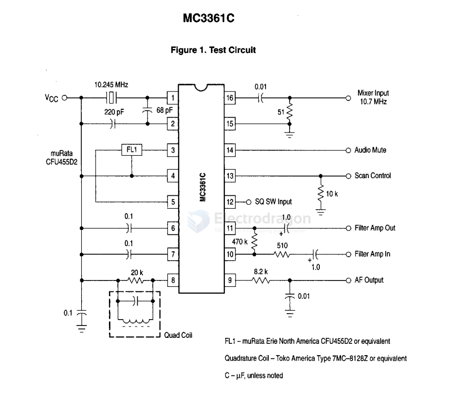
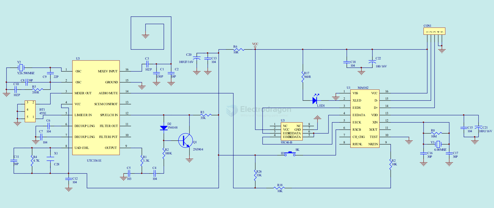

# MC3361-dat

DESCRIPTION

The UTC MC3361BP is designed for use in FM dual conversion communication. It contains a complete narrow band FM demodulation system operable to less than 2.5V supply voltage. This low-power narrow-band FM IF system provides the second converter, second IF, demodulator. Filter Amp and squelch circuitry for communications and scanning receivers.

FEATURES

- * Low power consumption (4.0mA typ. at Vcc=4.0V)
- * Excellent input sensitivity (-3dB limiting, 2.0mVrms typ.)
- * Minimum number of external components required.
- * Operating Voltage:2.5~7.0V

APPLICATIONS

- *Cordless phone (for home use)
- *FM dual conversion communications equipment

## application and SCH 

一款替代富士通MB15E03SL单通道频率合成器，工作频率可达1.2GHz， 工作电压范围2.2V-5.5V。包括一个双模前置分频器. RF分频器 64/65 or 128/129，一个可编程参考频率分频器 （R counter），一个可编程反馈频率分频器 （N counter）， 一个鉴相器， 一个电流可调电荷泵，LDO电压调制器， 以及3线串行接口（DATA, CLK, EN）。

本芯片与一个外置压控振荡器（VCO）和一个无源滤波器形成环路。通过3线串行接口配置参考频率分频器和反馈频率分频器的分频数，可以得到所需要的频率。

本芯片采用的是 0.35um CMOS制作工艺，封装形式为TSSOP-16。可以应用到无绳电话，无线Ｕ段麦克风，无线音响，无线耳机，手机，无线网络（WLAN)，无线通讯（PCS/PCN），有线电视调制器（Cable TV Tuner)，以及其他无线遥控与通讯系统等。

Low Power Narrowband FM IF

The MC3361C includes an Oscillator, Mixer, Limiting Amplifier, Quadrature Discriminator, Active Filter, Squelch, Scan Control and Mute Switch. This device is designed for use in FM dual conversion communications equipment.

- Operates from 2.0 to 8.0 V Supply
- Low Drain Current 2.8 mA Typical @ VCC = 4.0 Vdc
- Excellent Sensitivity: Input Limiting Voltage -
- - 3.0 dB = 2.6 µV Typical
- Low Number of External Parts Required
- Operating Frequency Up to 60 MHz
- Full ESD Protection

- [[MA6162-dat]] - [[93C46-B-dat]]

