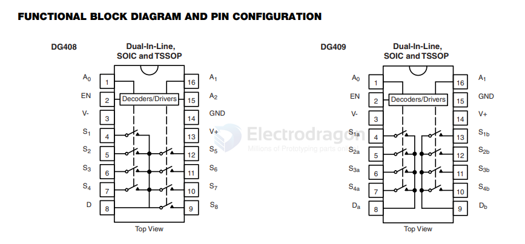

# DG408-dat

- [[vishay-dat]] - [[DG408-dat]] - [[multiplexer-dat]]

DESCRIPTION
The DG408 is an 8 channel single-ended analog multiplexer
designed to connect one of eight inputs to a common output
as determined by a 3-bit binary address (A0, A1, A2). The
DG409 is a dual 4 channel differential analog multiplexer
designed to connect one of four differential inputs to a
common dual output as determined by its 2-bit binary
address (A0, A1). Break-before-make switching action
protects against momentary crosstalk between adjacent
channels.
An on channel conducts current equally well in both
directions. In the off state each channel blocks voltages up
to the power supply rails. An enable (EN) function allows the
user to reset the multiplexer/demultiplexer to all switches off
for stacking several devices. All control inputs, address (Ax)
and enable (EN) are TTL compatible over the full specified
operating temperature range.
Applications for the DG408, DG409 include high speed data
acquisition, audio signal switching and routing, ATE
systems, and avionics. High performance and low power
dissipation make them ideal for battery operated and
remote instrumentation applications.
Designed in the 44 V silicon-gate CMOS process, the
absolute maximum voltage rating is extended to 44 V.
Additionally, single supply operation is also allowed. An
epitaxial layer prevents latchup.
For additional information please see Technical Article
TA201.

## SCH 

## ref 

