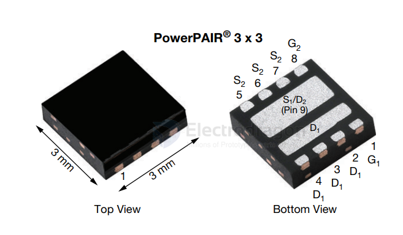
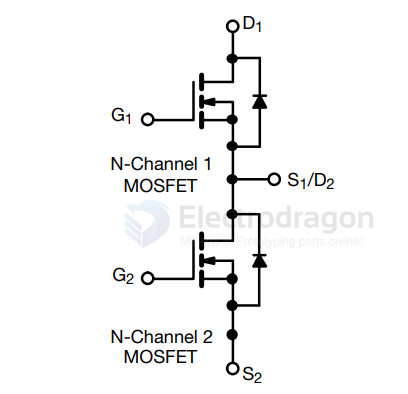

# SIZ322-dat

- [[vishay-dat]] - [[SIZ322-dat]] - [[mosfet-dat]]

FEATURES
• TrenchFET® Gen IV power MOSFET
• High side and low side MOSFETs form optimized
combination for 50 % duty cycle
• Optimized RDS - Qg and RDS - Qgd FOM elevates
efficiency for high frequency switching
• 100 % Rg and UIS tested
• Material categorization: for definitions of compliance
please see www.vishay.com/doc?99912
APPLICATIONS
• Synchronous buck
• DC/DC conversion
• Half bridge
• POL

Dual N-Channel 25 V (D-S) MOSFET