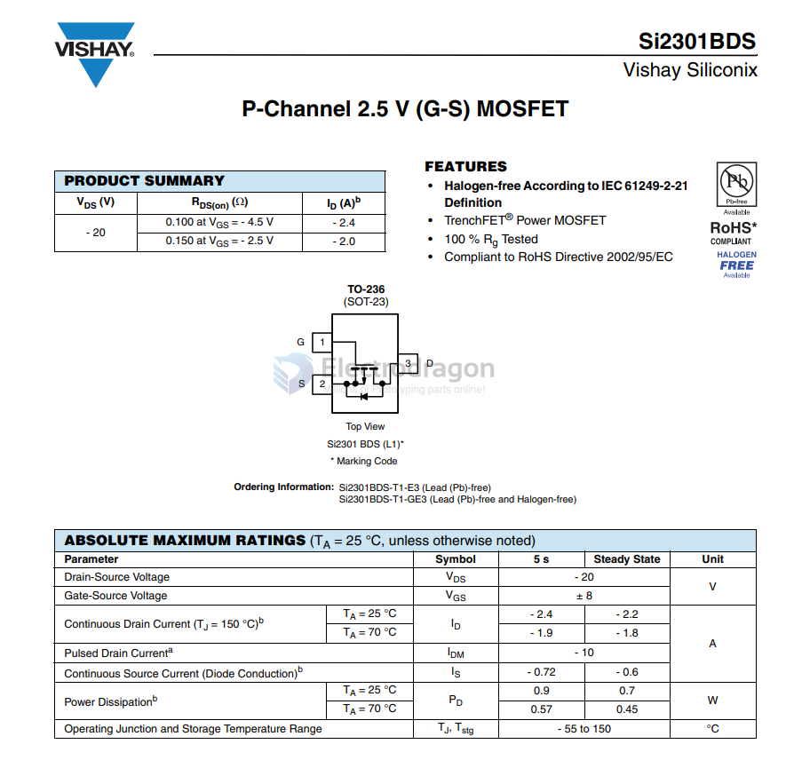
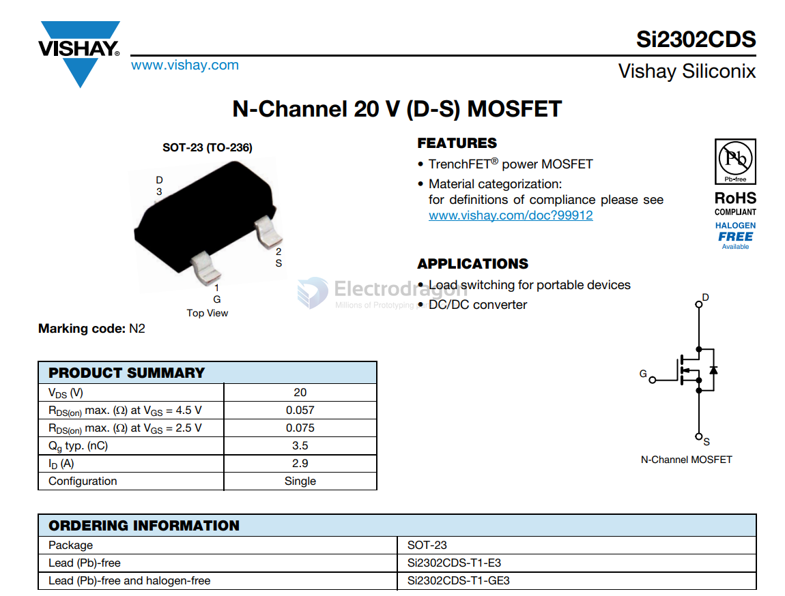

# vishay-dat

## Vishay TCPT Series / SFH Series

Like SFH757V / SFH250V

Designed for 1 mm plastic fiber with push-in mounting

These modules can accept bare fiber inserted directly into the plastic shroud, similar to what the PLT237/PLR237 allows.

## SI2301-dat 

## SI2302-dat

