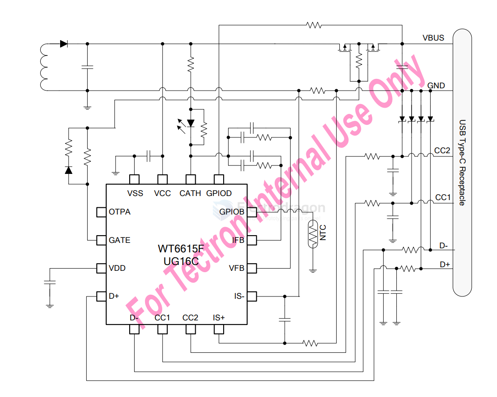
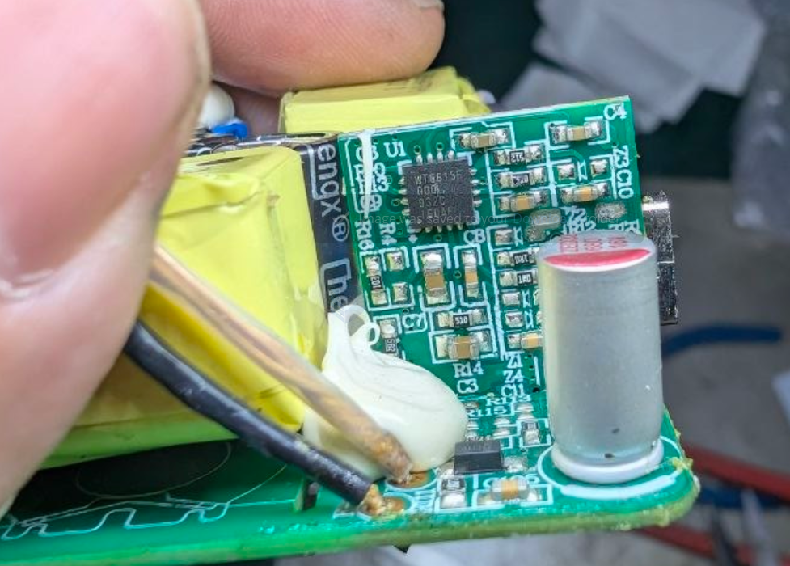
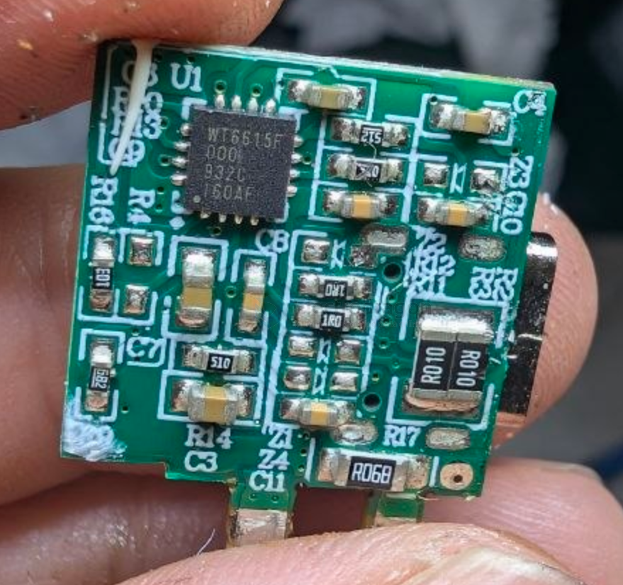

# weltrend-dat

- [[USB-FC4-dat]] - [[USB-PD3-dat]] - [[USB-SDK-dat]]

- [[winsok-dat]] - [[WSP4407-dat]] - [[mosfet-dat]]

`WT6615F` - USB PD Controller

WT6615F - USB Power Delivery and Qualcomm Quick Charge 4/4+ Controller

The WT6615F is a highly integrated USB Power Delivery (PD) controller that supports USB PD 3.0 Programmable Power Supply (PPS) specification and Qualcomm® Quick ChargeTM 4.0 or Quick Charge 4+ technologies designed for USB Type-C Downstream Facing Port (Source) charging applications such as power adapters, wall chargers, car chargers, power strip, power banks, and etc.

The WT6615F minimizes external components by integrating USB PD baseband PHY, Type-Cdetection, shunt regulator, voltage and current monitors, and control circuits of blocking MOSFET, and an 8-bit MCU to allow small form factor and low BOM cost. 

It supports wide operation voltage range from 3V to 30V without the need of an external LDO. A Multi-Time-Programmable (MTP) ROM is provided for program code and user configuration data.

https://taoic.oss-cn-hangzhou.aliyuncs.com/7581/product/tssemi168_1658973591000.pdf

## board  

- [[PCB-form-dat]]