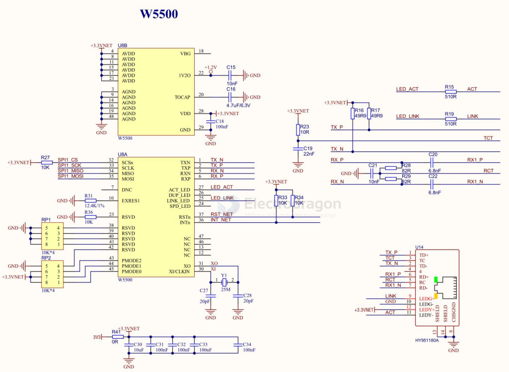

# W5500-dat

W5500 Datasheet

The W5500 chip is a Hardwired TCP/IP embedded Ethernet controller that provides easier Internet connection to embedded systems. W5500 enables users to have the Internet connectivity in their applications just by using the single chip in which TCP/IP stack, 10/100 Ethernet MAC and PHY embedded.

- datasheet == [[W5500_datasheet_v1.0.2_1.pdf]]

## SCH 

- HY951180A 

## ref 

- [[TCPIP-dat]] - [[UDP-dat]] - [[ethernet-dat]]