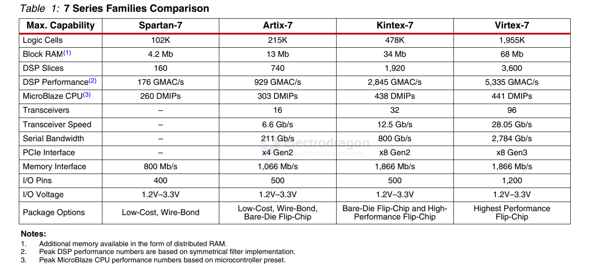
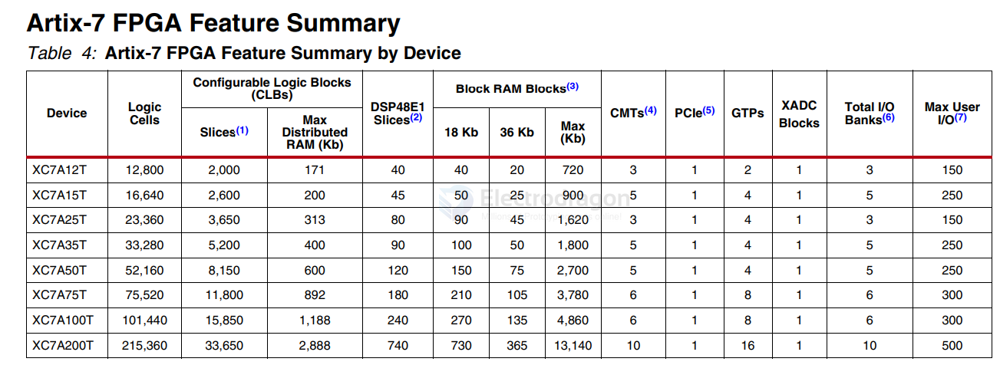

# xilinx-dat

## CPLD 

* XC9572XL

XILINX - CPLD 

* XC9536xl - 10
* XL9572xl - 12

* XC2C64 - 22
* XC2C32A - 32/44 pin

XC3S700A-4FG400C == Spartan®-3A Field Programmable Gate Array (FPGA) IC 311 368640 13248 400-BGA

XCR3064XL 64 Macrocell CPLD

## FPGA 

HW-USB-II-G == Platform Cable USB II == EEPROM, FPGA, PLD - Programmer (In-Circuit/In-System)

- [[AMD-dat]]

XC7K325T-1FBG676C - IC FPGA 400 I/O 676FCBGA - 	
Kintex®-7 Field Programmable Gate Array (FPGA) IC 400 16404480 326080 676-BBGA, FCBGA

XC7Z045-1FFG900I - IC SOC CORTEX-A9 667MHZ 900FCBGA

	
Dual ARM® Cortex®-A9 MPCore™ with CoreSight™ System On Chip (SOC) IC Zynq®-7000 Kintex™-7 FPGA, 350K Logic Cells 667MHz 900-FCBGA (31x31)

[Zynq-7000 SoC Data Sheet: Overview](https://docs.amd.com/v/u/en-US/ds190-Zynq-7000-Overview)

## FPGA 

[7 Series FPGAs Data Sheet: Overview](https://docs.amd.com/v/u/en-US/ds180_7Series_Overview)

XC7A200T - FPGA - Field Programmable Gate Array XC7A200T-1FFG1156I

### Artix-7 FPGA Feature Summary

## unsort 

- XC4005E
- XC95108
- XC95288XL
- XC95144

## ref 

- [[CPU-dat]]

- [[chip-dat]]