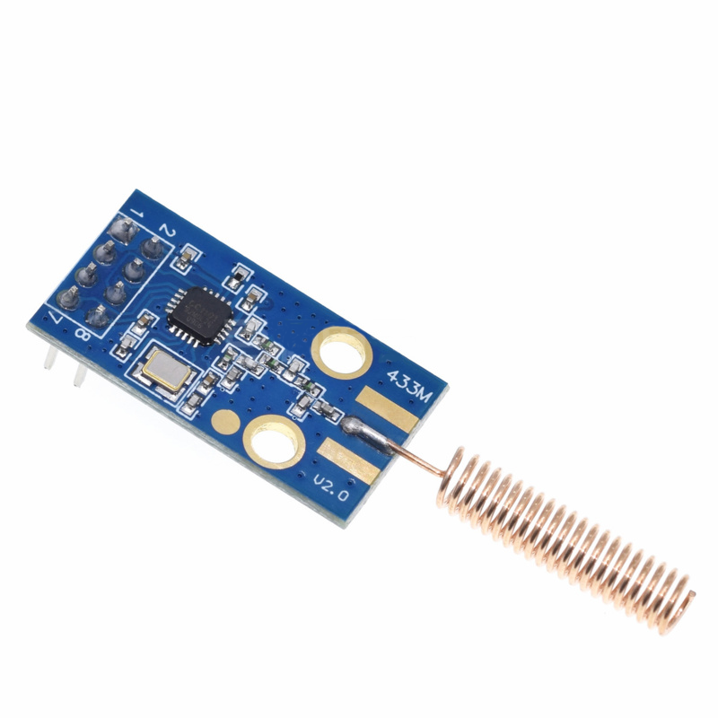

# CC1101 DAT

- CC1101-LSS: Low Power, SPI interface, Spring Coil
- CC1101-LUS: Low Power, UART TLL interface, Spring Coil - [[NWL1042-DAT]]
- CC1101-LUR: Low Power, UART TTL interface, rod antenna
- CC1101-MSR: Medium Power, SPI interface, rod antenna

## updated version

## ref 

-  legacy wiki - https://w.electrodragon.com/w/CC1101

- [[RF-DAT]] - [[RF]]