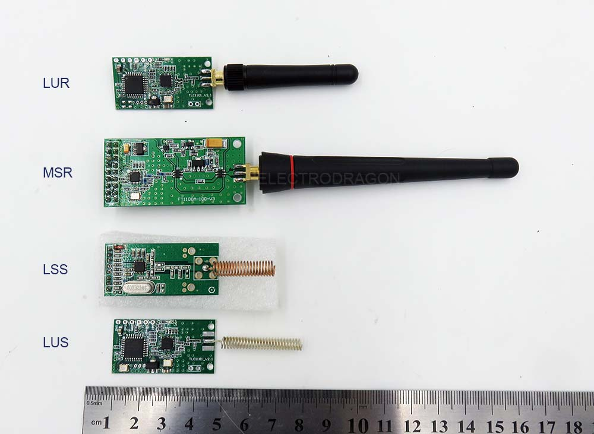

# CC1101 DAT

## CC1101 Chip Features 
- Work on 433 MHz free ISM RF band, no need license.
- Built-in hardware CRC error detection, and address control
- The maximum rate of 500kbps (1.2K Min.), support for 2-FSK, GFSK, FSK and MSK modulation, support the transmission channel before the auto-clean-up visits (CCA), the Carrier Sense System, very suitable for using at industrial environment.
- Fast frequency changes brought about by a suitable synthesizer frequency hopping system
- Most 256 program channels (20M band).
- Large data buffer area. Separate 64-byte RX and TX data FIFO
- Address can be set up by software, only received local address only when the output data (provided interrupt instruction), can be directly connected using a variety of MCU, very convenient
- High sensitivity: 1.2Kbps under-110dBm, 1% packet error rate
- Lower current consumption: 20mA averagely in RX mode and 30mA averagely in TX mode, at 10dBm

## Board Versions 

- CC1101-LSS: Low Power, SPI interface, Spring Coil - [[NWL1037-DAT]]

- CC1101-LUS: Low Power, UART TLL interface, Spring Coil - [[NWL1042-DAT]]
- CC1101-LUR: Low Power, UART TTL interface, rod antenna - [[NWL1039-DAT]]
  
- CC1101-MSR: Medium Power, SPI interface, rod antenna - [[NWL1044-DAT]]

## ref 

-  legacy wiki - https://w.electrodragon.com/w/CC1101

- [[RF-DAT]] - [[RF]]