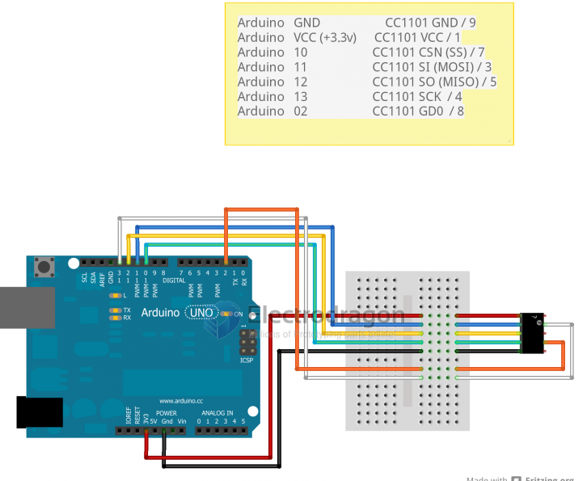
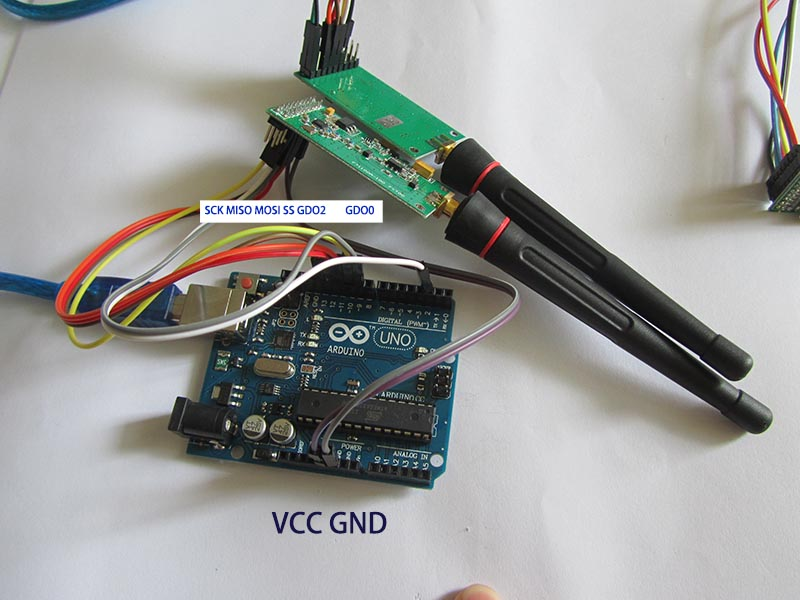

# CC1101 code

## wiring arduino

| CC1101 Pins | func | Arduino Pins | Description                                     |
| ----------- | ---- | ------------ | ----------------------------------------------- |
| SCK         | SCK  | 13           | Clock Pin                                       |
| SI          | MISO | 12           | Data input                                      |
| SO          | MOSI | 11           | Data output                                     |
| SS          | SS   | 10           | Chip select                                     |
| GDO2        | Pin  | 9            | output as a symbol of receiving or sending data |
| GDO0        | Pin  | 2            | serial clock output                             |
| VCC 3.3/5V  | VCC  | 3.3/5V       | VCC                                             |
| GND         | GND  | GND          | Ground                                          |

* Connect SPI to arduino SPI pins
* Demo code available in documents section below
* This is the demo code, you may need to add some delays (delay(3000);) to slow down the serial output

## Library code 

* SmartRF - http://www.ti.com/tool/smartrftm-studio 
* find the SmartRF tool to adjust the parapmeters of CC1101, such as frequency 433, 915, modulation ask, fsk, etc.
* Arduino Support Lib - [[RadioLib]]

