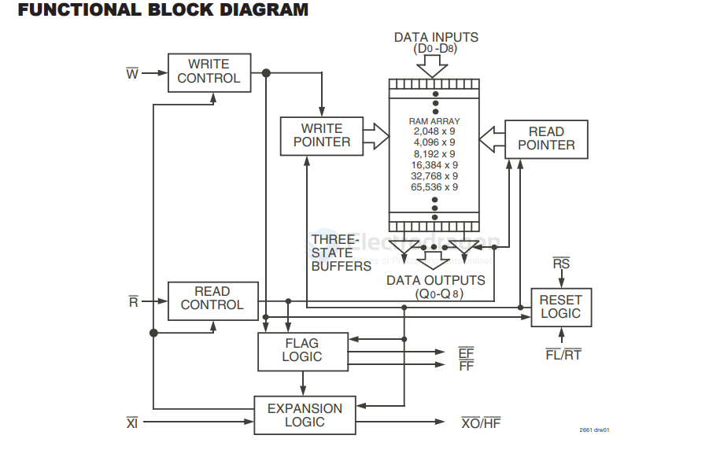

# buffer-FIFO-dat

- [[buffer-dat]] - [[buffer-FIFO-dat]]

- [[renesas-dat]] - [[buffer-FIFO-dat]] - [[IDT720x-dat]] - [[app-dat]] == [[sensor-camera-dat]]

CMOS ASYNCHRONOUS FIFO

- 2,048 x 9, 
- 4,096 x 9
- 8,192 x 9, 
- 16,384 x 9
- 32,768 x 9 
- 65,536 x 9

- IDT7203
- IDT7204
- IDT7205
- IDT7206
- IDT7207
- IDT7208

DESCRIPTION:

The IDT7203/7204/7205/7206/7207/7208 are dual-port memory buffers
with internal pointers that load and empty data on a first-in/first-out basis. The
device uses Full and Empty flags to prevent data overflow and underflow and
expansion logic to allow for unlimited expansion capability in both word size and
depth.

 Data is toggled in and out of the device through the use of the Write (W) and
Read (R) pins.

The device's 9-bit width provides a bit for a control or parity at the user’s
option. It also features a Retransmit (RT) capability that allows the read pointer
to be reset to its initial position when RT is pulsed LOW. A Half-Full Flag is
available in the single device and width expansion modes.

These FIFOs are fabricated using high-speed CMOS technology. They
are designed for applications requiring asynchronous and simultaneous read/
writes in multiprocessing, rate buffering and other applications.

Military grade product is manufactured in compliance with MIL-STD-883,
Class B.

## digram

## ref 