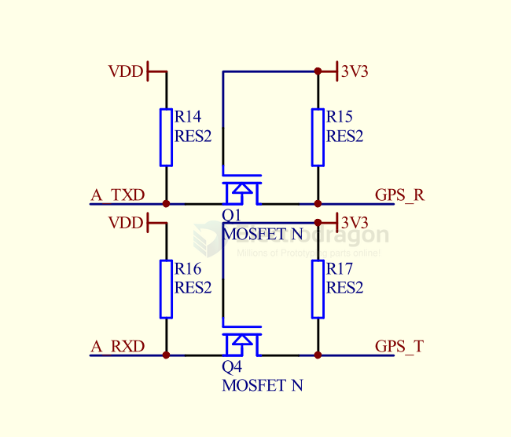
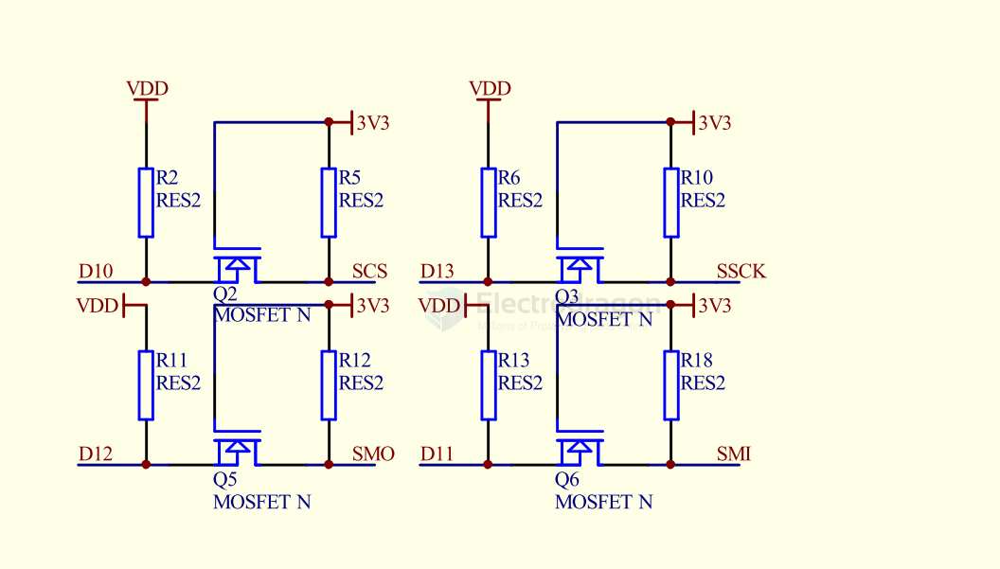
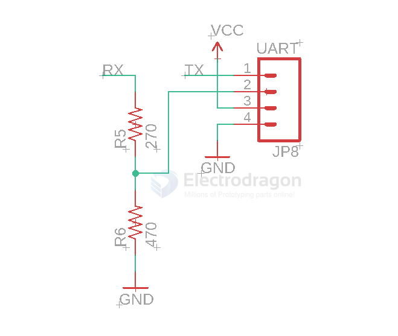

# Logic-shifter-dat

## board 

- [[MSP1007-dat]]

## Chip and solutions

### bidirection logic shifter

- [[ti-signal-dat]]

- [[TXB0108-dat]] - [[BSS138-dat]] 

- [[LSF0102-dat]]

- [[TXS0102-dat]] - [[TXS0108-dat]] - [[TI-logic-dat]]

### one-direction logic shifter

- [[74HCT245-dat]]

## TXB010x VS TXS010x 

For the same reason, the TXB0108 should not be used in applications such as I2C or 1-Wire where an open-drain driver is connected on the bidirectional data I/O. For these applications, use a device from the TI TXS01xx series of level translators.

| Type     | Open-Drive | Push-pull | Examples    |
| -------- | ---------- | --------- | ----------- |
| TXB 010x | ×          |           |             |
| TXS 010x | ✔          | ✔         | I2C, 1-Wire |

Make sure the VCCA ≤VCCB.

### Simple logic shifter for VBAT 

## logic level shifter for UART 

- Diode + pull-up resistor on RXD 

## Simple I2C shifter 

- [[I2C-dat]]

## 5V-3.3V 

- [[arduino-dat]] to 3.3V [[location-dat]] == [[serial-dat]]

- [[arduino-dat]] to 3.3V [[location-dat]] == [[SPI-dat]]

3.3V tolerant to [[RPI-SBC-dat]]

## unsort 

- MAX3372E–MAX3379E/MAX3390E–MAX3393E - ±15kV ESD-Protected, 1μA, 16Mbps, Dual/Quad Low-Voltage Level Translators in UCSP

EOF 

IP4856CX25 - The device is an SD 3.0-compliant 6-bit bidirectional dual voltage level translator. It is designed to interface between a memory card operating at 1.8 V or 2.9 V signal levels and a host with a fixed nominal supply voltage of 1.7 V to 3.6 V. The device supports SD 3.0, SDR104, SDR50, DDR50, SDR25, SDR12 and SD 2.0 high-speed (50 MHz) and default-speed (25 MHz) modes. The device has an integrated voltage selectable low dropout regulator to supply the card-side I/Os, built-in EMI filters and robust ESD protections (IEC 61000-4-2, level 4).

## ref 

- [[logic-shifter]]