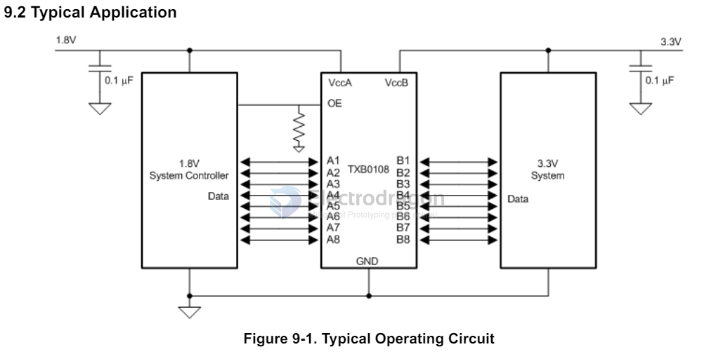
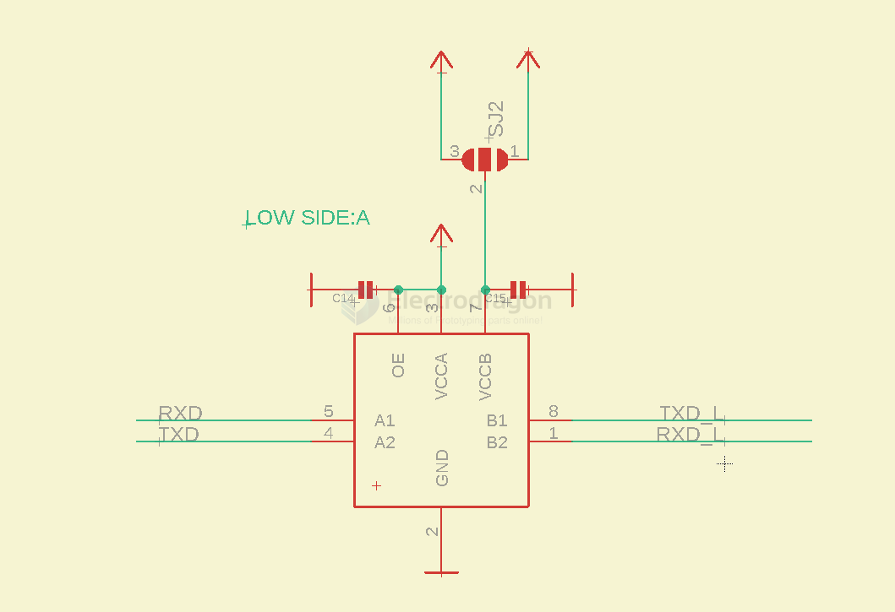
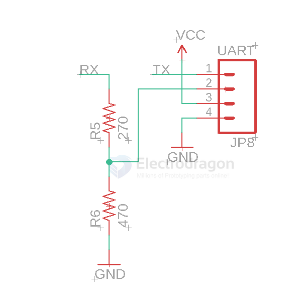
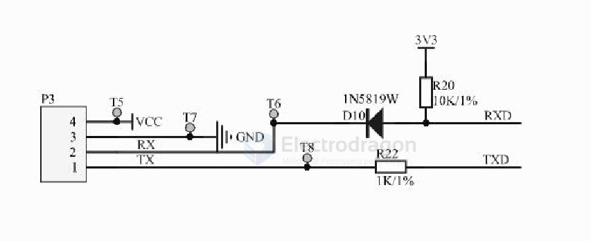
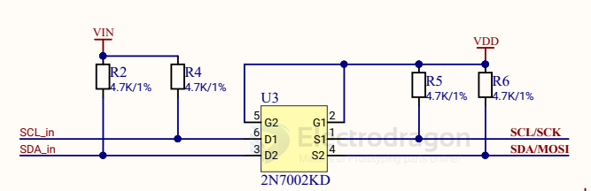
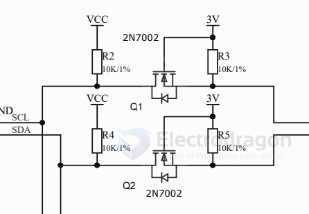
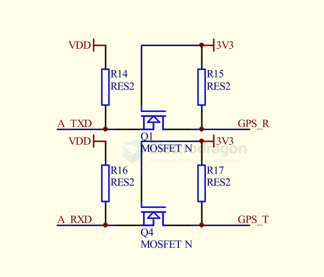
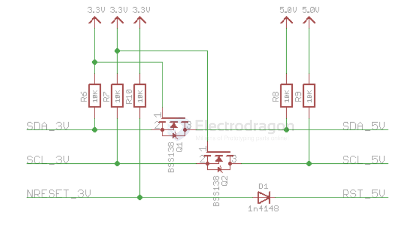
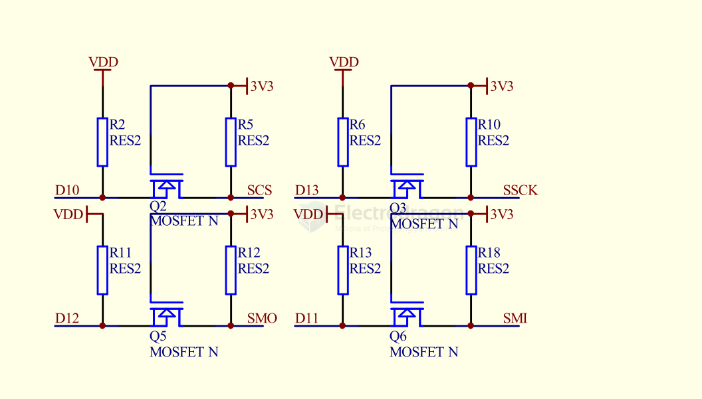
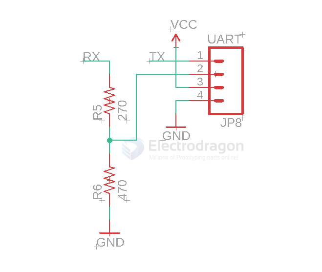

# logic-level-shifter-dat

- [[74HC125-dat]] - [[buffer-dat]] - [[74HC14-dat]]

- [[logic-level-shifter-dat]] - [[74xx1G125-dat]] - [[74hct245-dat]] - [[74HC4050-dat]]

## logic shifter for PWM 

- [[PWM-dat]] - [[buffer-dat]] - [[logic-level-shifter-dat]]

A **digital buffer** is the absolute best way to handle this. 

When people say "logic level shifter," they are often sold cheap, bi-directional boards with MOSFETs and 10kΩ pull-up resistors (like the classic I2C level shifters). **Do not use those for high-speed PWM.** The pull-up resistors are too slow, rounding off the sharp edges of your PWM signal and making the DRV8871 behave erratically.

Instead, you want a **uni-directional CMOS buffer** that can be powered by 5V but accepts 3.3V logic inputs. 

---

### The Industry Standard: The 74AHCT Series
The "**T**" in the part number is the secret. It stands for **TTL-compatible inputs**. A 74**AHCT** chip powered at 5V will recognize any input voltage above **2.0V** as a guaranteed logical `HIGH`. This is a perfect match for the ESP32’s 3.3V outputs.

Here are the two cheapest, most common buffer chips for this job:

#### 1. 74AHCT125 (Quad Buffer) - [[74HC125-dat]] - [[buffer-dat]] - [[74HC14-dat]]
* **What it is:** Contains 4 independent buffer channels.
* **Cost:** Around $0.20 to $0.50.
* **How to use it:** You feed the ESP32 PWM signals into the inputs (A), power the chip with 5V, tie the Output Enable (/OE) pins to Ground (to keep them always active), and the outputs (Y) will deliver clean, sharp 0–5V PWM signals to your DRV8871 drivers.

#### 2. 74AHCT14 (Hex Inverting Schmitt Trigger) 
* **What it is:** Contains 6 inverting buffers. 
* **Why it's great:** The Schmitt-trigger inputs have built-in hysteresis. If your ESP32 signals have electrical noise or "ground bounce" from those two 380 motors, this chip completely cleans it up into a crisp square wave.
* **Note:** Because it *inverts* the signal, a 100% duty cycle from the ESP32 becomes a 0% duty cycle at the driver. You just have to invert the logic in your ESP32 code (e.g., write `255 - speed`).

---

### Wiring Guide

If you add a 74AHCT125 buffer to your layout, wire it up like this:

| Buffer Pin | Connect To | Reason |
| :--- | :--- | :--- |
| **VCC** | +5V Rail | Powers the output side at full 5V logic. |
| **GND** | Clean Logic Ground | Reference ground. |
| **1A, 2A** | ESP32 PWM Pins | Receives the 3.3V control signals. |
| **1Y, 2Y** | DRV8871 `IN1`, `IN2` | Outputs the clean 5V push-pull signals. |
| **1OE, 2OE** | Ground (GND) | Enables the buffer outputs. |

Using a true CMOS buffer chip like this will give you sharp, fast switching edges up to several megahertz, completely eliminating any speed differences or glitching caused by weak 3.3V drive signals.

## board 

- [[MSP1007-dat]]

## Chip and solutions

### bidirection logic shifter

- [[TI-interface-dat]]

- [[TXB0108-dat]] - [[BSS138-dat]] 

- [[LSF0102-dat]]

- [[TXS0102-dat]] - [[TXS0108-dat]] - [[TI-logic-dat]]

Surface Mount TXS0102DCUR VSSOP-8 2-bit Bidirectional Voltage Level Shifter Chip

### one-direction logic shifter

- [[74HCT245-dat]]

## TXB010x VS TXS010x 

For the same reason, the TXB0108 should not be used in applications such as I2C or 1-Wire where an open-drain driver is connected on the bidirectional data I/O. For these applications, use a device from the TI TXS01xx series of level translators.

| Type     | Open-Drive | Push-pull | Examples    |
| -------- | ---------- | --------- | ----------- |
| TXB 010x | ×          |           |             |
| TXS 010x | ✔          | ✔         | I2C, 1-Wire |

Make sure the VCCA ≤VCCB.

### Simple logic shifter for VBAT 

## logic level shifter for UART 

simple passive solutions 

via chip 

- Diode + pull-up resistor on RXD 

## Simple I2C shifter 

- [[I2C-dat]]

## 5V-3.3V 

- [[arduino-dat]] to 3.3V [[location-dat]] == [[serial-dat]]

general 5V-3V3 logic 

- [[arduino-dat]] to 3.3V [[location-dat]] == [[SPI-dat]]

3.3V tolerant to [[RPI-SBC-dat]]

## unsort 

- MAX3372E–MAX3379E/MAX3390E–MAX3393E - ±15kV ESD-Protected, 1μA, 16Mbps, Dual/Quad Low-Voltage Level Translators in UCSP

EOF 

IP4856CX25 - The device is an SD 3.0-compliant 6-bit bidirectional dual voltage level translator. It is designed to interface between a memory card operating at 1.8 V or 2.9 V signal levels and a host with a fixed nominal supply voltage of 1.7 V to 3.6 V. The device supports SD 3.0, SDR104, SDR50, DDR50, SDR25, SDR12 and SD 2.0 high-speed (50 MHz) and default-speed (25 MHz) modes. The device has an integrated voltage selectable low dropout regulator to supply the card-side I/Os, built-in EMI filters and robust ESD protections (IEC 61000-4-2, level 4).

## ref 

- [[logic-shifter]]