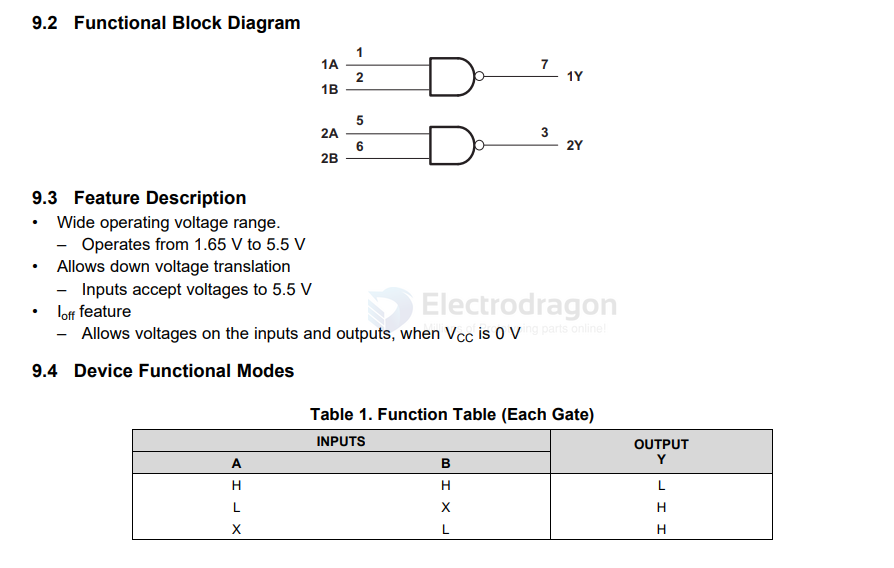

# logic-NAND-dat

- [[logic-XOR-dat]] - [[logic-NAND-dat]] - [[logic-inverter-dat]] - [[logic-gate-dat]]

- [[logic-NAND-dat]] - [[AD-logic-dat]] - [[logic-dat]]

SN74LV`C2G00 Dual 2-Input Positive-NAND Gate

https://assets.nexperia.com/documents/data-sheet/74HC_HCT10.pdf

`74HC10`; `74HCT10` Triple 3-input NAND gate

The 74HC10; 74HCT10 is a triple 3-input NAND gate. Inputs include clamp diodes that enable the
use of current limiting resistors to interface inputs to voltages in excess of VCC

## ref 

