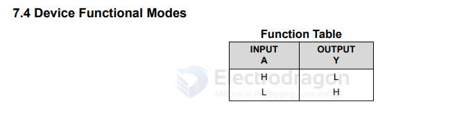
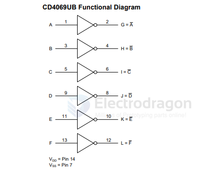
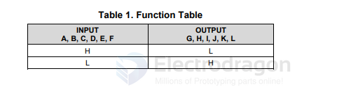

# logic-inverter-dat

- [[logic-XOR-dat]] - [[logic-NAND-dat]] - [[logic-inverter-dat]] - [[logic-gate-dat]]

how to select a suitable inverter 

- [[74HC14-dat]] - [[inverter-dat]]

- [[logic-inverter-dat]] - [[power-inverter-dat]]

- [[74LVC2G04]]

## chip 

- [[TI-dat]] - [[TI-logic-dat]] - [[logic-inverter-dat]] - [[logic-dat]]

- [[CD4069-dat]] - [[CD40xx-dat]] - [[logic-inverter-dat]] - [[logic-dat]]

## numbers 

### hex

- hex == 6chs == [[CD4069-dat]]

# inverter-dat

- 74HC14D 

## ref 

- [[logic-dat]]

## ref 

- [[74xx-dat]] - [[logic-inverter-dat]]