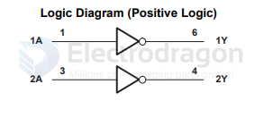

# logic-inverter-dat

how to select a suitable inverter 

- [[74HC14-dat]] - [[inverter-dat]]

- [[logic-inverter-dat]] - [[power-inverter-dat]]

- [[74LVC2G04]]

- [[TI-dat]]

SN74LVC2G14 — Dual Schmitt-Trigger Inverter

The SN74LVC2G14 contains two independent Schmitt-trigger inverters and implements the Boolean function Y = 
¬A (inverter). Key features and corrected description:

- Supply voltage: 1.65 V to 5.5 V (VCC)
- Package: NanoFree™ package technology (die as the package)
- Function: Two inverters with Schmitt-trigger inputs (separate thresholds for rising and falling edges)
  - Positive-going threshold: Vt+
  - Negative-going threshold: Vt-
- Special feature: The Schmitt action provides hysteresis, improving noise immunity and signal clean-up on slow or noisy inputs.
- Power-down behavior: The device is specified for partial-power-down applications using Ioff outputs. The Ioff circuitry prevents damaging current backflow through the device when it is powered down while other parts of the system remain powered.

Notes:
- Use this device when you need level translation, input hysteresis, or signal conditioning across a wide VCC range.

[[logic-inverter-dat]]

# inverter-dat

- 74HC14D 

## SN74LVC2G04 Dual Inverter Gate

https://www.ti.com/lit/ds/symlink/sn74lvc2g04.pdf

Table 1. Function Table (Each Inverter)

| INPUT (A) | OUTPUT (Y) |
| --------- | ---------- |
| H         | L          |
| L         | H          |

## ref 

- [[logic-dat]]

## ref 

- [[74xx-dat]] - [[logic-inverter-dat]]