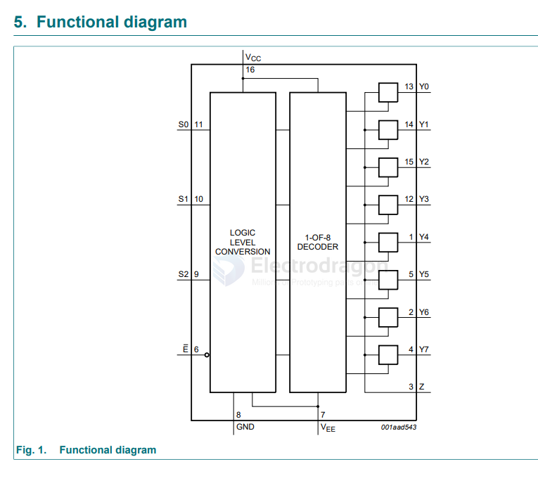

# multiplexer-dat

- [[AD-logic-dat]] - [[logic-dat]] - [[multiplexer-dat]]

- [[Multiplexer-dat]] - [[74xx-dat]]

- [[74HC4067-dat]]

74HC4051; 74HCT4051 - 8-channel analog multiplexer/demultiplexer

74HC138; 74HCT138 - 3-to-8 line decoder/demultiplexer; inverting

TMUX7208,TMUX7209 - TMUX720x 44V, Latch-Up Immune, 8:1, 1-Channel and 4:1, 2-Channel Precision Multiplexers with 1.8V Logic

## ref 

- [[circuits-dat]]