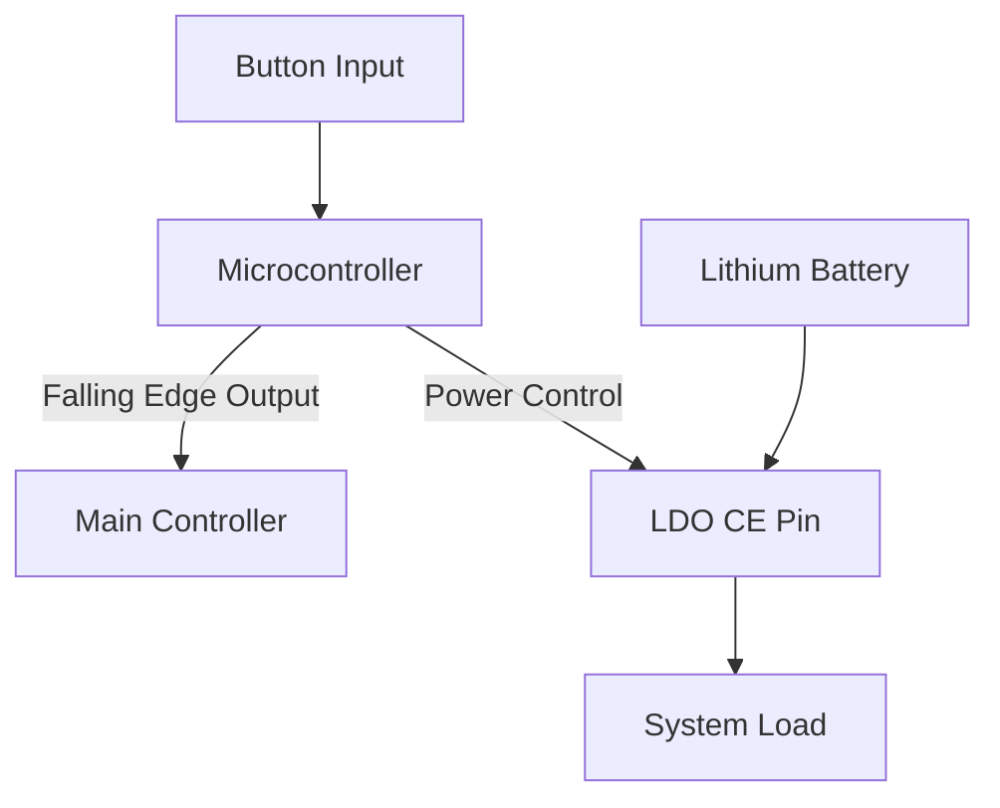

# power-on-dat

# Power-On Circuit Data

This tutorial describes a reliable power-on/off circuit using a low-cost microcontroller, suitable for battery-powered applications with ultra-low standby current.

## Overview

I built a circuit using a 0.25 RMB microcontroller and have used it for half a year with excellent reliability. The design features:

- One button input
- One output (to the main controller)
  - When the power-off button is detected, the output generates a falling edge, allowing the main controller to save data.
- The power control output drives the CE (chip enable) pin of an LDO regulator.
- Powered by a single lithium battery.
- In the off state, the circuit consumes almost no battery power. Even after being off for one or two months, the battery still retains charge.

## Example Components

- **PMS150C SOT23-6** (by Padauk)
  - Price: 0.13 RMB
  - Used in smart robot projects for power on/off control.
  - Standby current: 2μA

- **Huimang Micro SOT23-6** (likely PIC core)
  - Suitable for low-power applications.
  - Other models tested: working current 600μA, sleep current as low as 2μA.
  - For this simple design, sleep current was not measured, but estimated at 1.5μA.
  - Combined with the LDO, total standby current should be below 10μA.

## Circuit Operation

## ref 

- [[power-on]] - [[circuits]]