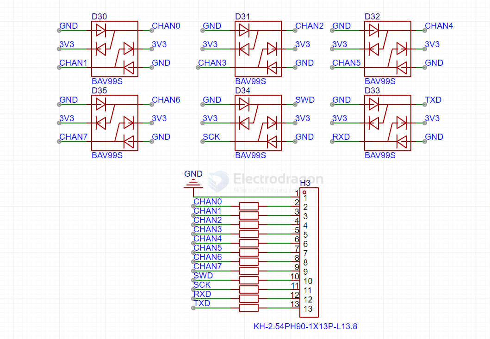

# ESD-dat

- [[USB-ESD-dat]]

- [[ethernet-ESD-dat]] - [[ethernet-dat]]

- [[ethernet-ESD-dat]]

- [[POE-dat]]

## TPD4EUSB30

## dual diode clamp ESD protectoin 

Two diodes connected in series with a **common node**.

---

## 2. Pin Configuration
If you connect it like:
- One diode goes from **Common → 3.3V**  
- Other diode goes from **Common → GND**

It means:
- **D1**: Cathode at 3.3V, Anode at Common  
- **D2**: Anode at GND, Cathode at Common  

So the common pin sits in the **middle** between **0V (GND)** and **3.3V (VCC)**, clamped by diodes.

---

## 3. Purpose of This Setup
This creates a **clamp/protection circuit**:
- If the signal on the **Common pin** rises above **3.3V + Vf (~3.9V)** → the upper diode conducts → clamps to 3.3V rail.  
- If the signal falls below **0V – Vf (~–0.7V)** → the lower diode conducts → clamps to GND.  

👉 This is often used as an **ESD protection** or **logic level protection** for sensitive inputs.

