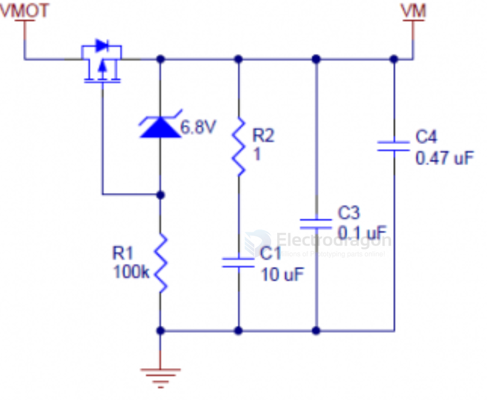

# power-protection-Vmotor-dat

## Example 2. for Motor Power Input 

- reverse-votlage-protection == [[mosfet-dat]]
- voltage [[diode-zener-dat]] 6.8V - [[diode-dat]] == [[OVP-dat]] == over-voltage protection
- inrush-protection == 1R + 10UF 
- [[decoupling-capacitor-dat]]:  C3 = 0.1UF + C4 == 0.47UF

- ref == [[TB6612-dat]]
