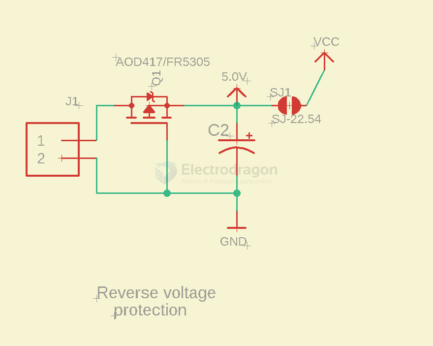

# power-protection-dat

- [[power-protection-Vmotor-dat]]

- inrush + anti-reverse protection 

## Input protection 

- [[SB1045-dat]] - [[sensor-NTC-dat]] == NTC10D-11

- [[sensor-dat]]

The input protection circuit uses two main components:

- **NTC10D-11 (NTC Thermistor):**  
  When power is first applied, this thermistor has a high resistance, which limits the inrush current to downstream components (such as large capacitors or sensitive ICs). As it heats up from current flow, its resistance drops, allowing normal operation with minimal voltage drop.

- **SB1045L (Schottky Diode):**  
  This diode is oriented to allow current to flow only in the correct direction. If the power supply is connected in reverse, the diode blocks the current, preventing damage to the rest of the circuit.

**Summary:**  
- The NTC thermistor protects against inrush current at power-on.
- The Schottky diode protects against reverse polarity.
- Together, they ensure only safe, properly oriented power reaches the back end of the circuit.

## reverse-votlage-protection

### Inrush Protection 

#### 🔧 1. Current Limiting for Transients / Inrush

- When power is applied from **VMOT**, the capacitors (C1, C3, C4) initially act as short circuits.
- R2 (1 Ω) limits the **inrush current** that charges capacitor **C1 (10 µF)**.
- This protects components and reduces voltage spikes or noise.

#### 🎛️ 2. Filtering / Decoupling

- R2 and C1 form a **low-pass RC filter**.
- This filter smooths out high-frequency noise from the supply line.
- It helps ensure a stable voltage at the **VM** output node.

- [[low-pass-rc-filter-dat]]

## reverse connection

In circuit board design, protecting against reverse polarity (reverse connection) is crucial to prevent damage to components or the entire circuit when the power supply is connected incorrectly. Here are some common methods for reverse polarity protection:

### Diode-Based Protection:

Series Diode: Place a diode in series with the power line (Vcc or GND). When the power is connected correctly, the diode conducts, allowing current to flow. If the power is reversed, the diode blocks the current. The downside is a voltage drop across the diode (about 0.7V for a silicon diode or 0.2V for a Schottky diode), which can affect power efficiency.
Parallel Diode with Fuse: A diode is connected in reverse across the power input. If the power is connected incorrectly, the diode conducts and shorts the power supply. A fuse is used in series to blow and cut off the current, protecting the circuit. However, the fuse needs replacement after it blows.

### P-Channel MOSFET Reverse Protection:

A P-channel MOSFET is placed between the positive power input and the circuit. When the power is connected correctly, the source of the MOSFET is at a higher potential than the gate, so the MOSFET conducts. If the power is reversed, the MOSFET is turned off, preventing current from flowing. This method is highly efficient with minimal voltage drop.

- [[mosfet-dat]]

### and for N-channel Mosfet: Correct Low-Side N-Channel MOSFET Configuration:

- Source: Should be connected to ground (or the negative side of the load).
- Drain: Should be connected to the negative side of the load.
- Gate: Needs to be driven by a voltage higher than the source (which is ground in this case) to turn the MOSFET on.

### Dedicated Reverse Polarity Protection IC:

There are integrated circuits (ICs) specifically designed for reverse polarity protection, such as Maxim Integrated's MAX1614. These ICs typically include detection and switching functions, automatically disconnecting the power when reverse polarity is detected.

### Physical Connector Design:

Using connectors that are physically asymmetric, like USB-C or polarized DC jacks, ensures that the power supply can only be connected in the correct orientation. This is a straightforward method to prevent reverse polarity.

## Circuit Protection 

To prevent damage to downstream circuits, several design strategies and protective measures can be implemented to guard against overcurrent, overvoltage, and other fault conditions. Here are some common approaches:

1. Overcurrent Protection: (OC)
   
**Fuse**: A traditional protection component that cuts off current when it blows. It’s suitable for one-time protection but requires replacement after activation.

**Resettable Fuse (PTC)**: A PTC (positive temperature coefficient) fuse increases its resistance when too much current flows. Once the fault clears, it resets itself. This is useful for repeated protection.

**Current-Limiting Resistor**: A simple resistor can limit the amount of current flowing to downstream circuits. This is a basic solution but may affect performance.

**Overcurrent Detection and Shutdown (Current-Sensing Circuit)**: Using a current-sensing circuit (e.g., a shunt resistor + op-amp), it detects when the current exceeds a threshold and shuts down the power with a MOSFET or relay.

2. Overvoltage Protection: (OV)

**TVS Diode (Transient Voltage Suppression Diode)**: A TVS diode is placed across the power line. When the voltage spikes, it clamps the excess voltage to a safe level, protecting the circuit.

**Zener Diode**: A Zener diode can regulate voltage. When the input voltage exceeds its breakdown voltage, it conducts and clamps the voltage to protect the circuit.

**Voltage Detection IC**: These ICs monitor the input voltage, and if it exceeds safe limits, they either shut down the power or trigger a protection mechanism.

3. Overtemperature Protection: (OT)

**Thermistors (NTC/PTC)**: Thermistors change resistance with temperature. In case of overheating, their resistance increases, limiting current flow or triggering protective circuits.

**Temperature-Sensing ICs**: Temperature sensors (e.g., NTC, PTC, or specialized ICs) monitor real-time temperature. If it exceeds a threshold, they shut down the load or power source to protect the circuit.

4. Inrush Current Protection:

**Soft-Start Circuit**: Using MOSFETs and capacitors, this circuit gradually ramps up the power, preventing large inrush currents when the circuit first powers on.

**NTC Inrush Current Limiter:** An NTC thermistor initially limits the inrush current. As the circuit stabilizes, its resistance decreases, allowing normal current flow.

5. Isolation Protection:

**Optocouplers**: Optocouplers provide signal isolation between circuits, preventing high voltage or abnormal signals from damaging downstream components.

**Transformer Isolation**: Transformers can isolate power circuits, protecting the downstream components from high voltage spikes or electrical noise.

6. Undervoltage Protection:

**Undervoltage Lockout (UVLO) Circuit**: This circuit disconnects power when the input voltage falls below a safe operating range, preventing malfunctions or damage due to insufficient power.

7. Reverse Polarity Protection:

**MOSFET Reverse Polarity Protection**: Using a P-channel or N-channel MOSFET can prevent damage if the power is connected in reverse, as the MOSFET will automatically block current flow in the wrong direction.

8. Using Protection ICs:

There are integrated circuits specifically designed for power protection, offering multiple safeguards like overvoltage, overcurrent, overtemperature, and short-circuit protection. An example is the TPS series from Texas Instruments, which simplifies the design with built-in protections.

## ref 

- [[power-dat]]

