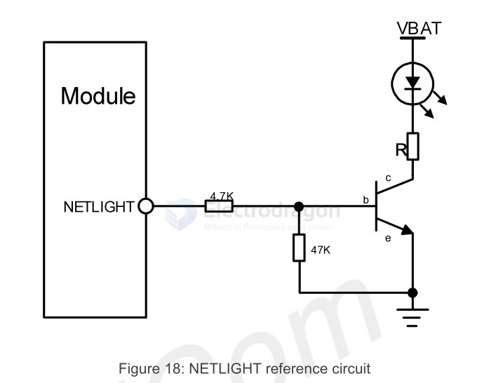

# status-dat

Table 13: NETLIGHT pin status
| NETLIGHT pin status | Module status                                                                            |
| ------------------- | ---------------------------------------------------------------------------------------- |
| 64ms ON, 800ms OFF  | No registered network                                                                    |
| 64ms ON, 3000ms OFF | Registered network (PS domain registration success)                                      |
| 64ms ON, 300ms OFF  | Data transmit (PPP dial-up state and use of data services such as internal TCP/FTP/HTTP) |
| OFF                 | Power off or PSM mode                                                                    |

