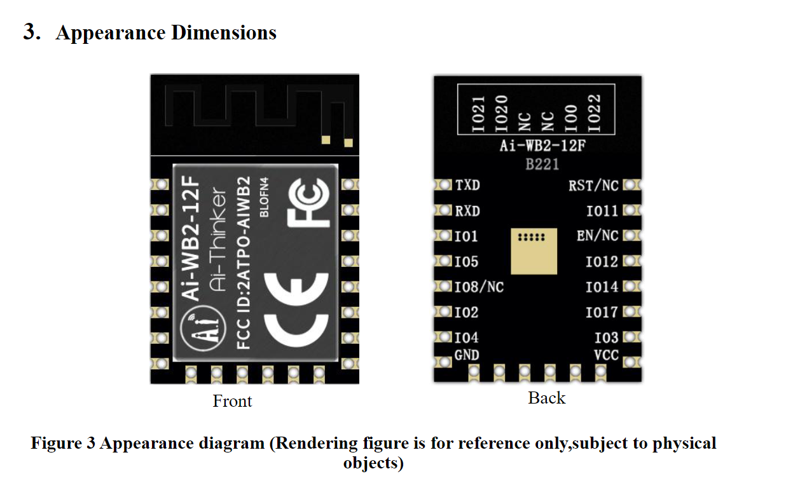
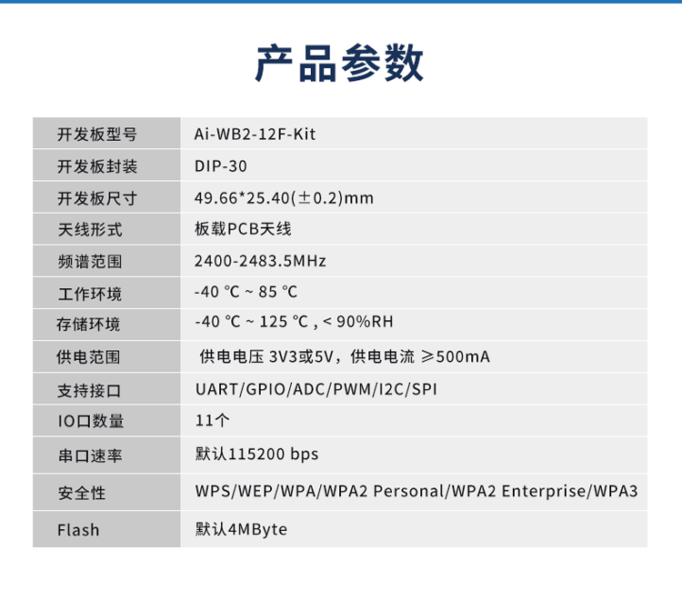
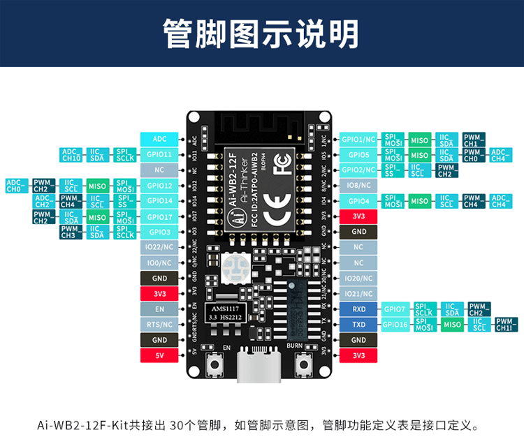
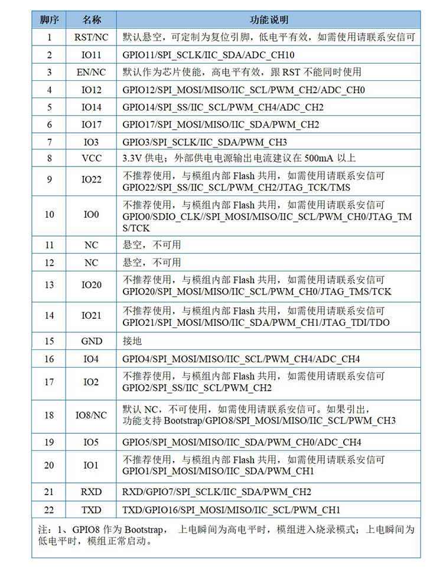

# AI-WB2-12F-DAT

## MOD INFO 

## SDK 
https://docs.ai-thinker.com/wb2 

1. 二次开发SDK源码地址：https://github.com/Ai-Thinker-Open/Ai-Thinker-WB2

2. 二次开发Linux开发环境搭建：https://aithinker.blog.csdn.net/article/details/125604649

3. 二次开发windows开发环境搭建：https://aithinker.blog.csdn.net/article/details/125660852

4. 二次开发编程指南：https://wb2-api-web.readthedocs.io/en/latest/docs/api-guides/index.html

5. 固件烧录指南：https://aithinker.blog.csdn.net/article/details/125781602

## DEV

