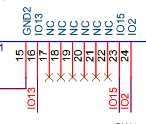

# ESP32-WROOM-DAT

| version            | Flash      | Suffix | SKU             |
| ------------------ | ---------- | ------ | --------------- |
| ESP32-WROOM-32D-N4 | 4MB = 32Mb | N4     | [[NWI1155-dat]] |
| ESP32-WROOM-32D-N8 | 8MB = 64Mb | N8     | [[NWI1194-dat]] |

- [[ESP32-DAT]]

## ESP32-WROOM-32E DAT

https://www.espressif.com/sites/default/files/documentation/esp32-wroom-32e_esp32-wroom-32ue_datasheet_en.pdf

6 Peripheral Schematics

### updates 

## ESP32-WROOM-32D DAT

https://www.espressif.com/sites/default/files/documentation/esp32-wroom-32d_esp32-wroom-32u_datasheet_cn.pdf

- [[NWI1155-dat]]