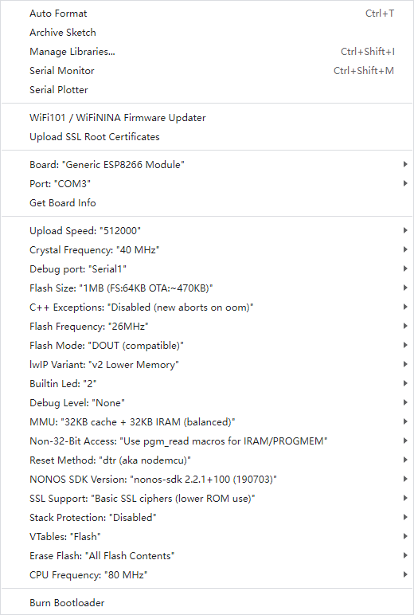

# ESP-01 DAT

- [[ESP8266-DAT]]

## hardware 

1. GND - Ground
2. GPIO2 - General Purpose Input/Output
3. GPIO0 - General Purpose Input/Output (Used for boot mode too)
4. UXRXD - Receiver (for serial communication)
5. U0TXD - Transmitter (for serial communication)
6. CH_PD - Chip powerdown
7. EXT_RSTB - Reset
8. VCC - 3.3v input voltage

### on board LED 

https://www.microchip.ua/wireless/esp01.pdf

The blue LED on the ESP-01 module is connected to GPIO1 (UART0_TXD)

## arduino uploading 
- debug set to serial1 or disable 
- crystal 40M 
- flash 26M 
- DOUT
- v2 
- buildin LED = 2 or else

## 乱码问题