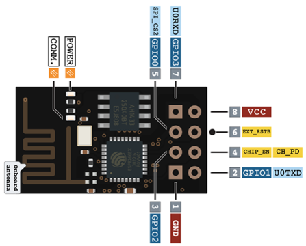

# ESP-01 DAT

1. GND - Ground
2. GPIO2 - General Purpose Input/Output
3. GPIO0 - General Purpose Input/Output (Used for boot mode too)
4. UXRXD - Receiver (for serial communication)
5. U0TXD - Transmitter (for serial communication)
6. CH_PD - Chip powerdown
7. EXT_RSTB - Reset
8. VCC - 3.3v input voltage

