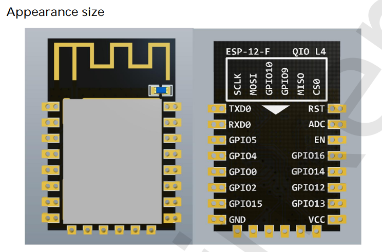

# ESP-12F-DAT

https://docs.ai-thinker.com/_media/esp8266/docs/esp-12f_product_specification_en.pdf

https://www.elecrow.com/download/ESP-12F.pdf

| left | --                         | right | --                 | func        |
| ---- | -------------------------- | ----- | ------------------ | ----------- |
| RST  | external pull-up, with cap | TXD   |                    |             |
| ADC  |                            | RXD   |                    |             |
| EN   | external pull-up           | IO5   |                    |             |
| IO16 |                            | IO4   |                    |             |
| IO14 |                            | IO0   | external pull-up   | mode select |
| IO12 |                            | IO2   | external pull-up   |             |
| IO13 |                            | IO15  | external pull-down |             |
| VCC  |                            | GND   |                    |             |
