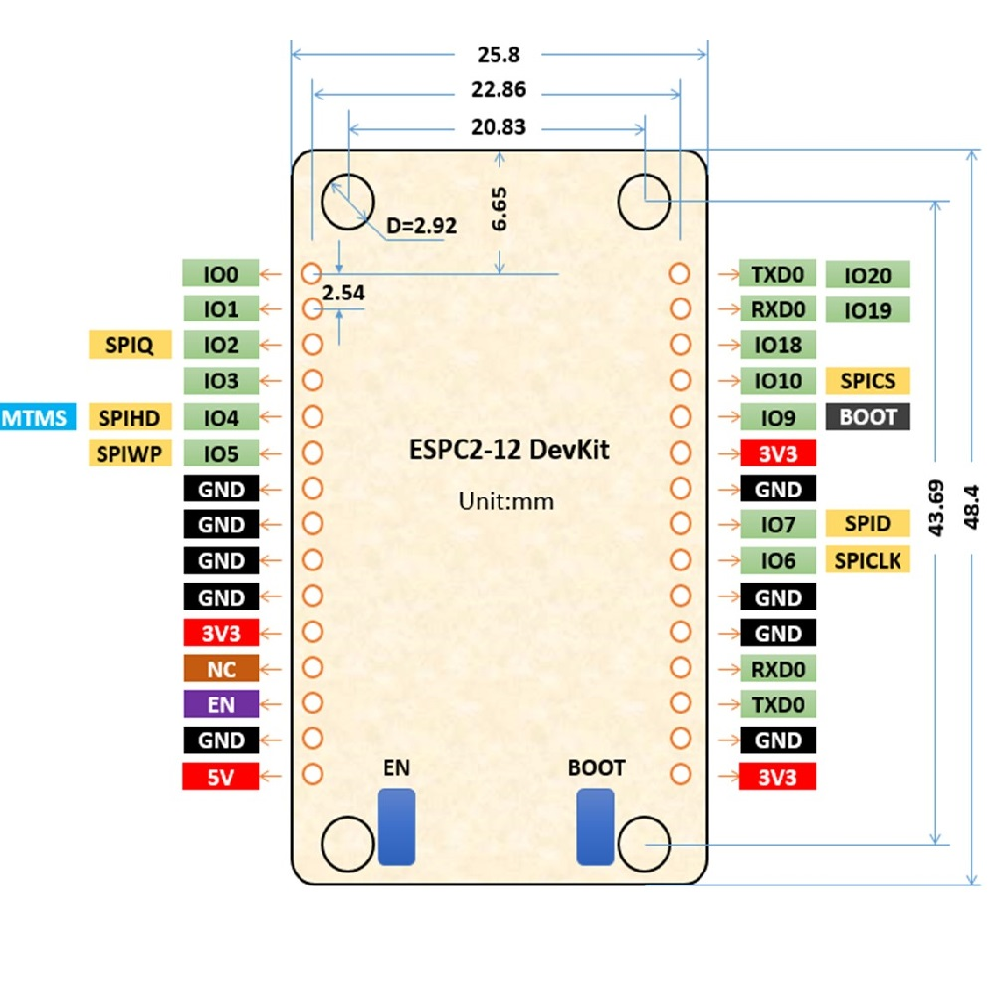
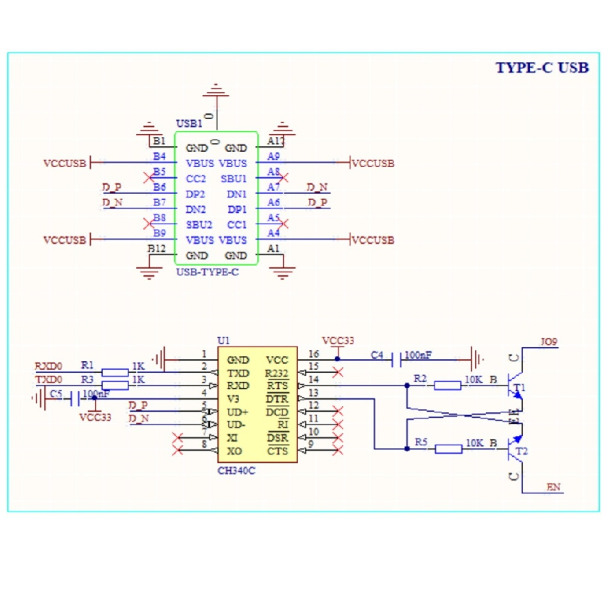
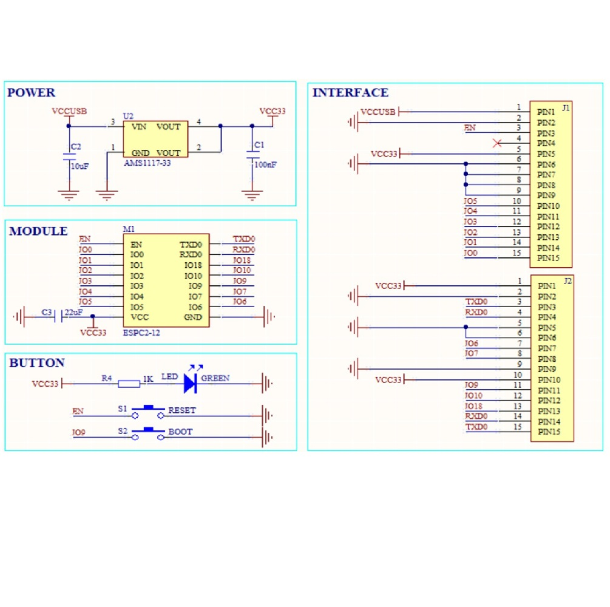
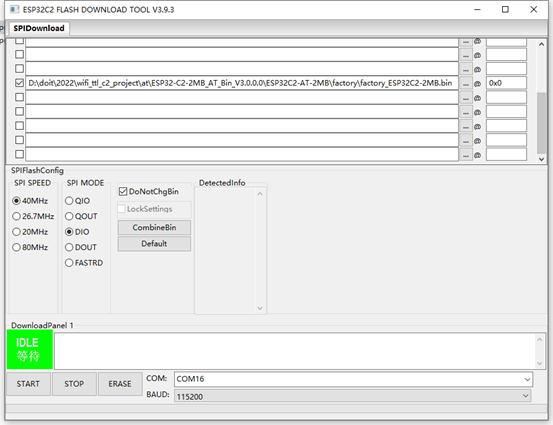

# ESPC2-12-DEV

## flash 

### AT指令集
- • AT：测试 AT 启动
- • AT+RST：重启模块
- • AT+GMR：查看版本信息
- • AT+CMD：查询当前固件支持的所有命令及命令类型
- • AT+GSLP：进入 Deep-sleep 模式
- • ATE：开启或关闭 AT 回显功能
- • AT+RESTORE：恢复出厂设置
- • AT+UART_CUR：设置 UART 当前临时配置，不保存到 flash
- • AT+UART_DEF：设置 UART 默认配置, 保存到 flash
- • AT+SLEEP：设置 sleep 模式
- • AT+SYSRAM：查询当前剩余堆空间和最小堆空间
- • AT+SYSMSG：查询/设置系统提示信息
- • AT+SYSFLASH：查询或读写 flash 用户分区
- • AT+FS：文件系统操作
- • AT+FSMOUNT：挂载/卸载文件系统
- • AT+RFPOWER：查询/设置 RF TX Power
- • AT+SYSROLLBACK：回滚到以前的固件
- • AT+SYSTIMESTAMP：查询/设置本地时间戳
- • AT+SYSLOG：启用或禁用 AT 错误代码提示
- • AT+SLEEPWKCFG：设置 Light-sleep 唤醒源和唤醒 GPIO
- • AT+SYSSTORE：设置参数存储模式
- • AT+SYSREG：读写寄存器
