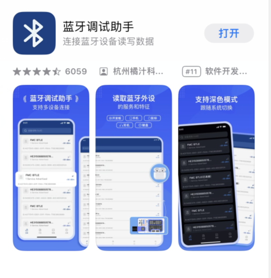
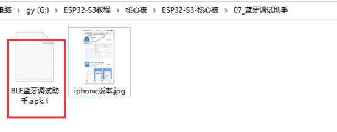
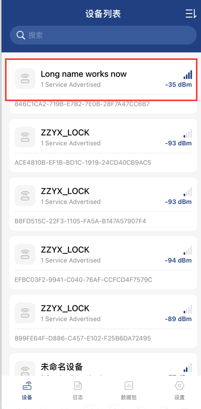

# BLE-dat

- [[data-storage-dat]] 

- [[nimBLE-dat]]

- [[ibeacon-dat]] - [[BLE5-dat]]

### Mobile Apps for BLE Debugging

### iOS Apps

For iPhone users, you can download the following software for debugging:

### Android Apps

For Android devices, you can directly install the following apps:

- lightBlue in google store 

- [[BLE蓝牙调试助手.apk.1]] - [[BT-Connect.apk]]

- nRF Connect for Mobile by [[nordic-dat]]

  - https://play.google.com/store/apps/dev?id=7265678888812659353&hl=en_US

- or download at https://t.me/electrodragon3/397

## BLE Operations Guide

### Reading and Writing Bluetooth Data

### Connection Process

1. **Auto Connection:** Click on the Bluetooth device name to automatically connect

2. **Custom Characteristic Access:**
   - Click on "Custom Characteristic"
   - Click the **Read** button to read user-defined values
   - After writing data, read it back to verify the written values

### Usage Steps

1. Connect to the BLE device by tapping its name
2. Navigate to "Custom Characteristic" section
3. Use **Read** function to retrieve custom values
4. Use **Write** function to send data
5. **Verify** by reading back the written values BLE Tool

- nRF Toolbox for Bluetooth LE - nrf52840 - https://play.google.com/store/apps/details?id=no.nordicsemi.android.nrftoolbox&hl=en_US

- nRF Connect for Mobile

- https://play.google.com/store/apps/dev?id=7265678888812659353&hl=en_US

- [[JDY-dat]] - [[JDY-25M-dat]] 

- Wireshark 

## ref 

- [[antenna-design-dat]]