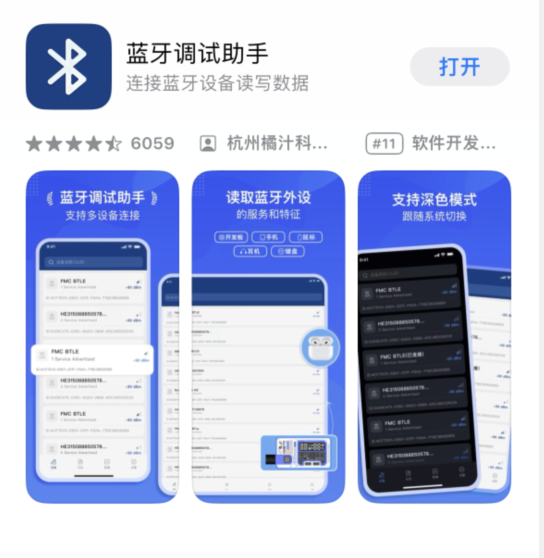
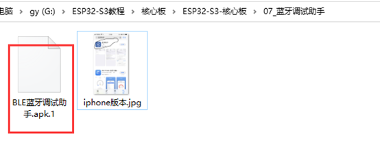

# BLE-dat

- [[BT-SDK-dat]]

- [[BLE-dat]] - [[bluetooth-dat]] - [[mesh-node-dat]] - [[node-dat]]

- [[data-storage-dat]] 

- [[nimBLE-dat]]

- [[ibeacon-dat]] - [[BLE5-dat]]

## debugs apps 

- [[BLE蓝牙调试助手.apk.1]] - [[BT-Connect.apk]] @ [[BLE-dat]]

## options 

- [[NRF52840-dat]]

- [[ESP32-dat]]

## tools 

- nRF Toolbox for Bluetooth LE - nrf52840 - https://play.google.com/store/apps/details?id=no.nordicsemi.android.nrftoolbox&hl=en_US

- nRF Connect for Mobile

- https://play.google.com/store/apps/dev?id=7265678888812659353&hl=en_US

- Wireshark 

## Mobile Apps for BLE Debugging

### iOS Apps

For iPhone users, you can download the following software for debugging:

### Android Apps

For Android devices, you can directly install the following apps:

- lightBlue in google store 

- [[BLE蓝牙调试助手.apk.1]] - [[BT-Connect.apk]]

- nRF Connect for Mobile by [[nordic-dat]]

  - https://play.google.com/store/apps/dev?id=7265678888812659353&hl=en_US

- or download at https://t.me/electrodragon3/397

## boards 

- [[EY-dat]] - [[EY-25M-dat]] 

## APP 

- [[head-track-dat]]

- [[smartband-dat]]

## BLE chip options 

- [[PHY-co-dat]]

## ref 

- [[antenna-design-dat]]