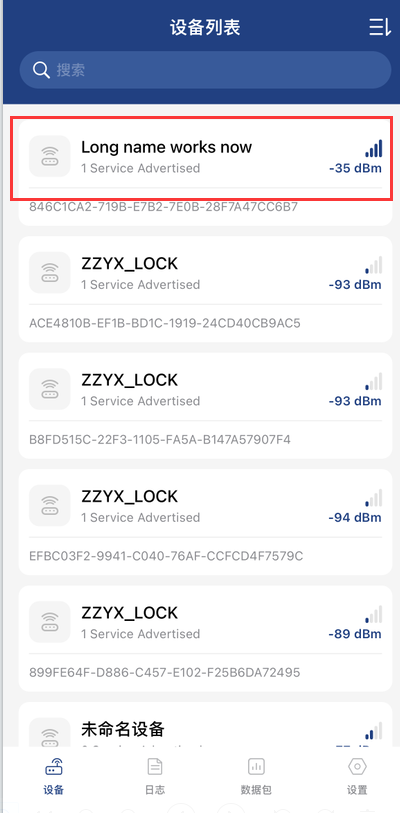
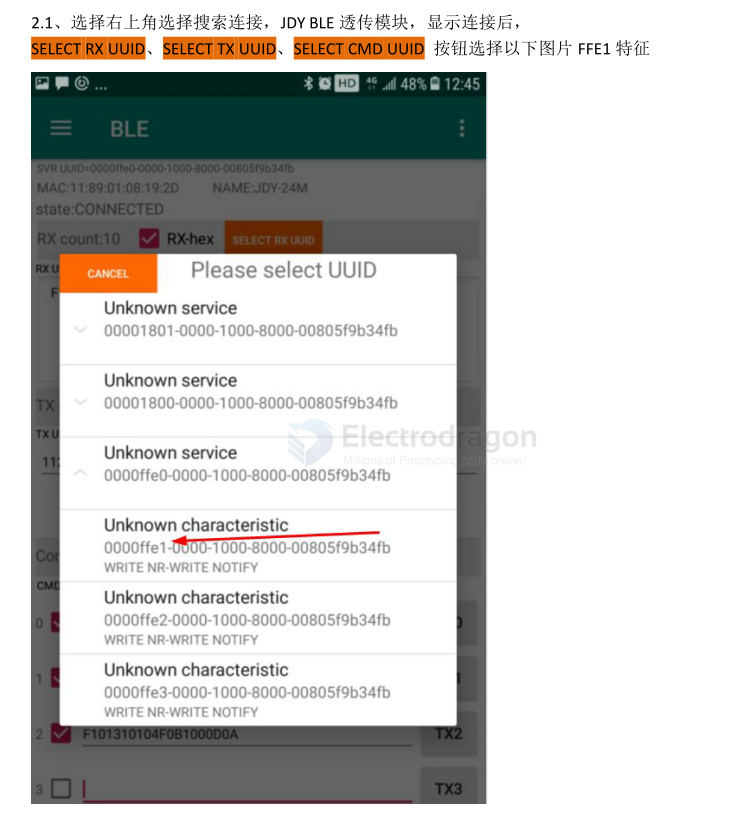
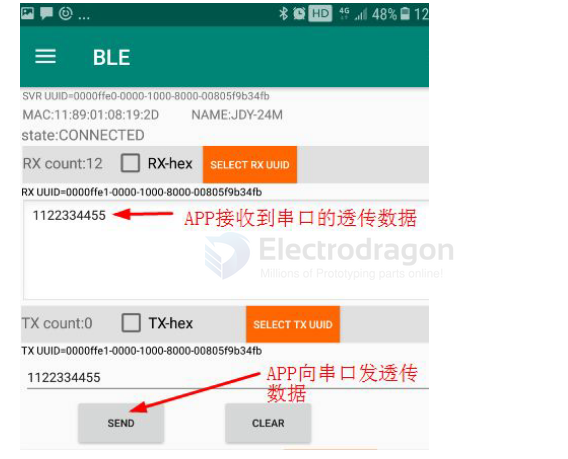
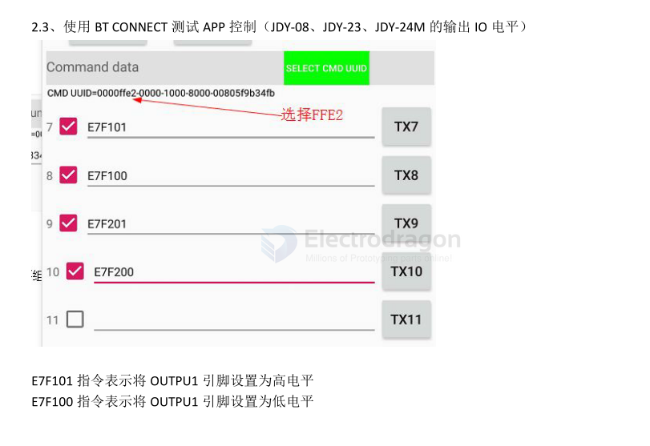
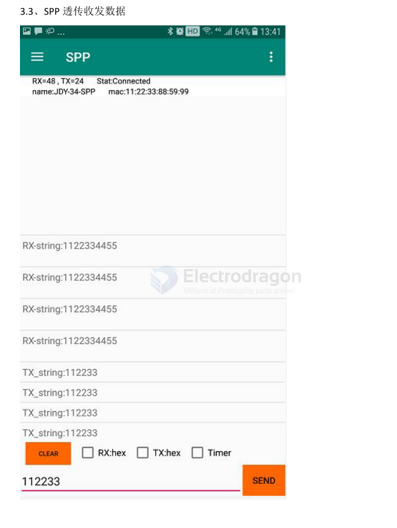

# BLE-SDK-dat

- programmer - [[BT-SDK-dat]] - [[DPR1112-dat]] - [[qualcomm-dat]]

- [[CSR8635-dat]] - [[CSR-dat]] - [[BT-SDK-dat]]

## debugs apps 

- [[BLE蓝牙调试助手.apk.1]] - [[BT-Connect.apk]] @ [[BLE-dat]]

## BLE Operations Guide == BT-connect

all steps done by `BT-connect `

### BLE Reading and Writing Bluetooth Data

#### Connection Process

1. **Auto Connection:** Click on the Bluetooth device name to automatically connect

2. **Custom Characteristic Access:**
   - Click on "Custom Characteristic"
   - Click the **Read** button to read user-defined values
   - After writing data, read it back to verify the written values

#### Usage Steps

1. Connect to the BLE device by tapping its name
2. Navigate to "Custom Characteristic" section
3. Use **Read** function to retrieve custom values
4. Use **Write** function to send data
5. **Verify** by reading back the written values BLE Tool

select UUID `FFE1` == data transceiver 

select UUID `FFE2` == IO Control 

### SPP 

SPP send and receive 

## Which BLE Example to Use for Sending ADC Voltage to Phone

Your goal:  
- ESP32 reads ADC (battery voltage).  
- Phone should receive/read the value over BLE.  

### Best Choices
- **Notify** ✅  
  - ESP32 acts as a BLE server.  
  - Sends **automatic notifications** with the ADC voltage.  
  - Best if you want real-time updates on your phone.  

- **Server** ✅  
  - ESP32 acts as a BLE server.  
  - Phone connects and **reads the ADC value on demand**.  
  - Good if you don’t need constant updates.  

- **UART** ✅  
  - Implements a BLE serial-like service.  
  - You can "print" ADC values and read them with a BLE UART app.  
  - Easiest for testing/debugging, but less standard.  

### Not Suitable
- **Beacon / iBeacon / EddystoneTLM_Beacon / EddystoneURL_Beacon** ❌  
  - These only broadcast fixed or simple data.  
  - Not designed for continuous ADC updates.  

- **Scan / Beacon_Scanner / Client / Client_secure_static_passkey** ❌  
  - These examples make ESP32 a **client/scanner**, not a server.  
  - Your phone should be the client, so not useful here.  

- **BLE5_extended_scan / BLE5_multi_advertising / BLE5_periodic_advertising / BLE5_periodic_sync** ❌  
  - Advanced BLE5 features (scanning, multi-adv, periodic sync).  
  - Not needed for simple ADC-to-phone communication.  

- **Server_multiconnect / Server_secure_authorization / Server_secure_static_passkey** ❌  
  - Variants of the Server example with multi-client or security features.  
  - Only needed if you want multiple phones connected or secure pairing.  

## ref 

- [[bluetooth-dat]]