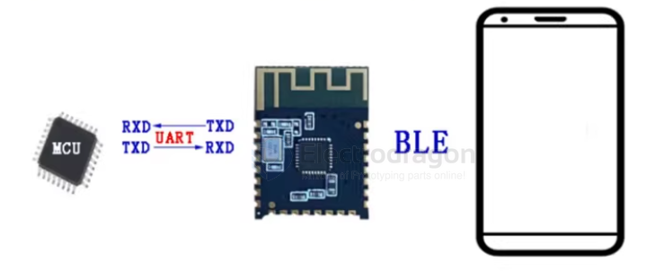
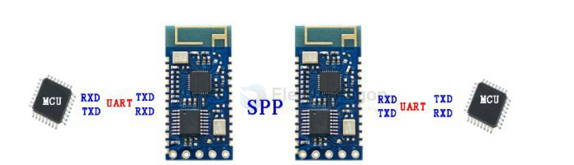
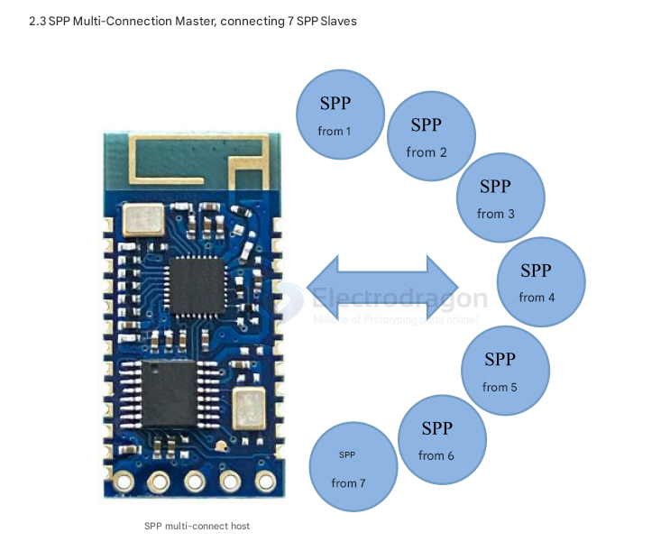

# bluetooth-dat 

- [[bt-audio-dat]]

- [[bt-debug-dat]]

- [[BT-dual-mode-dat]]

- [[BLE-dat]] - [[BT-SPP-dat]] - [[BT4.0-dat]] - [[ibeacon-dat]] - [[mesh-node-dat]]

- [[BLE-SDK-dat]]

## boards 

- [[NBL1101-dat]] == [JDY-25M Bluetooth 5.0 BLE5.0 Mesh Networking Module](https://www.electrodragon.com/product/jdy-25m-bluetooth-5-0-ble5-0-mesh-networking-module/)

- [[NBL1100-dat]] == [EDBT6 Bluetooth Data Transmission Module, BLE SPP Dual](https://www.electrodragon.com/product/edbt6-bluetooth-data-transmission-module-ble-spp-dual/)

- [[NBL1107-dat]] == [BLE 5.0 Mesh Sensor Node Mini Board Mesh-Node](https://www.electrodragon.com/product/ble-5-0-mesh-sensor-node-mini-board-mesh-node/)

- high price == [[NBL1064-dat]] == [Bluetooth IO Control Board EDR 2.0, BLK_IO](https://www.electrodragon.com/product/bluetooth-io-control-board-edr-2-0-blk_io/)

## Mode 

Host: used to search for slave devices and cannot be searched by other devices. (Bluetooth module with white dot)

Slave machine: The device used to be searched, and cannot actively search for other devices.

After the master and slave are connected, it is used as a serial port line. At this time, the master and slave are not distinguished, which is the transparent transmission mode.

[This module can be set as a master or a slave. The master can pair and communicate with the slave. There cannot be communication between slaves and slaves or between the master and the host. The slave can communicate with computers, mobile phones, etc. via Bluetooth. The default when purchasing is slave]

## BT Types 

### classical bluetooth

board - [[NBL1018-dat]] - [[NBL1057-dat]] - [[NBL1064-dat]]

module - [[NBL1012-dat]] - [[NBL1022-dat]] 

demo video 
- [new video](https://www.youtube.com/watch?v=d3qrE-TmKoE&ab_channel=Electrodragon)
- [old video](https://www.youtube.com/watch?v=CmMGhHMciu8)

### BT4.0

- [[NBL1060-dat]] - [[NBL1061-dat]]

### BT5.0

### Bluetooth Mesh 

### audio bluetooth

- [[NBL1055-dat]] - [[NBL1089-dat]]

## phone APPs

- BlueSPP
- nRF connect 

## APPs 

- [[iBeacon-dat]]

## Chip 

- [[TI-network-dat]] - [[nordic-dat]]

## working mode 

- [[MCU-dat]] - [[serial-dat]] - [[NBL1064-dat]]

## master and slave mode 

master connect to multiple slave mode 

slave connect to multiple master mode 

## ref 

- [[bluetooth]]