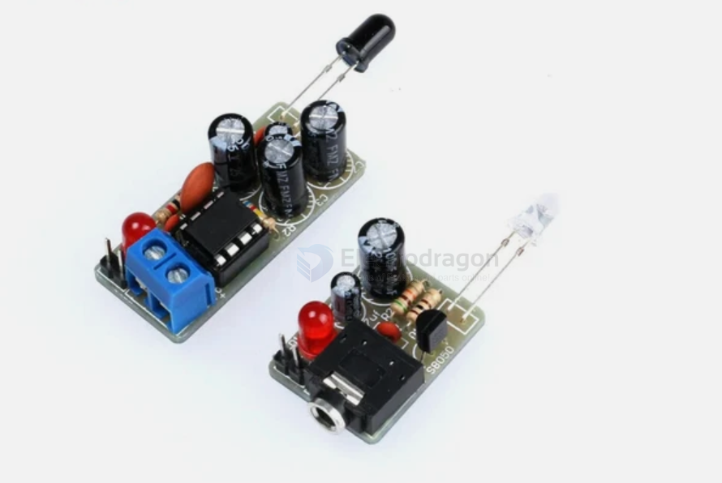
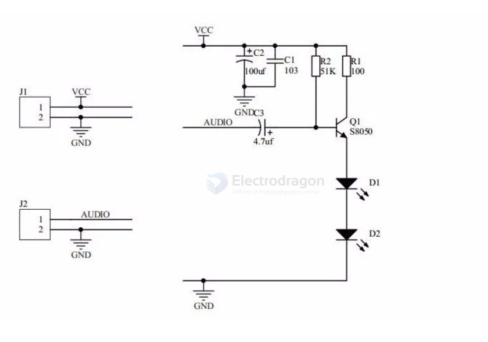
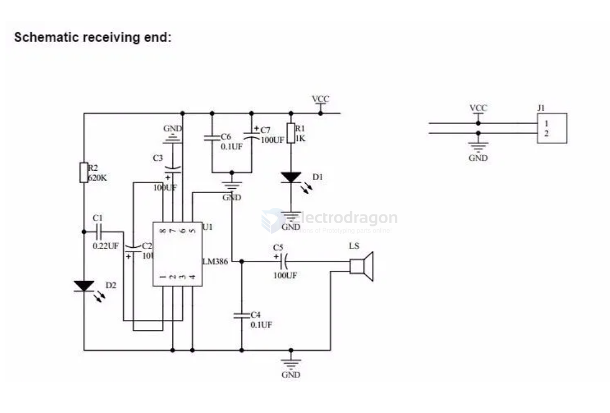
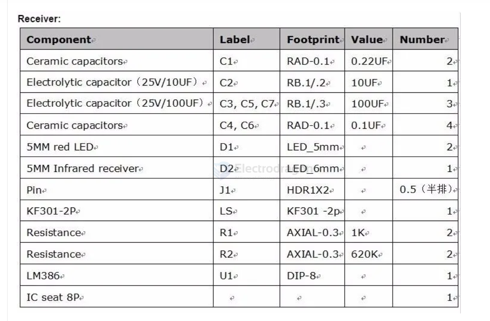

# infrared-app-dat

- [[infrared-app-dat]] - [[LM386-dat]] - [[infrared-dat]] - [[audio-dat]] - [[app-dat]]

## sound transfer carried on infrared 

1). `The transmitting end`: the headset port, the audio signal input through the transistor Q1 S8050, an infrared transmitter to drive the tube, and the audio signal is transmitted in the form of infrared.

2). `The receiving end`: the infrared receiving tube for receiving the infrared signal transmitter, converted into an audio signal through the LM386 audio amplifier chip, and the audio output signal can be amplified

Components List

Transmitter:  Component.  Label  Footprint  Value  Number
- Ceramic capacitors  C1  RAD-0.1  103  2
- Electrolyticcapacitor（25V/100UF）  C2  RB.1/.3  100UF  1
- Electrolytic capacitor（25V/4.7UF）  C3  RB.1/.2  4.7UF  1
- 5MM red LED  D1  LED_5mm  2
- 5MM Infrared emission control  D2  LED_6mm  1
- Pin  J14  HDR1X2  0.5（半排）
- Headphone seat  J2  3F07  1
- S8050  Q1  TO-92B  1
- Resistance  R1  AXIAL-0.3  100  2
- Resistance  R2  AXIAL-0.3  51K  2

## ref 

