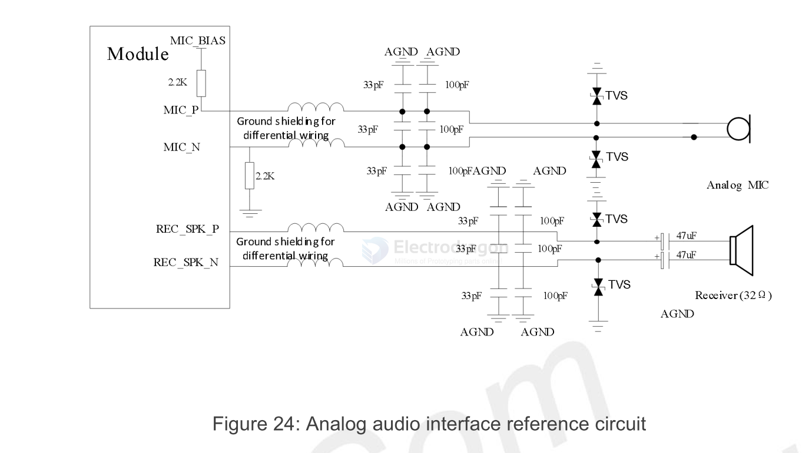
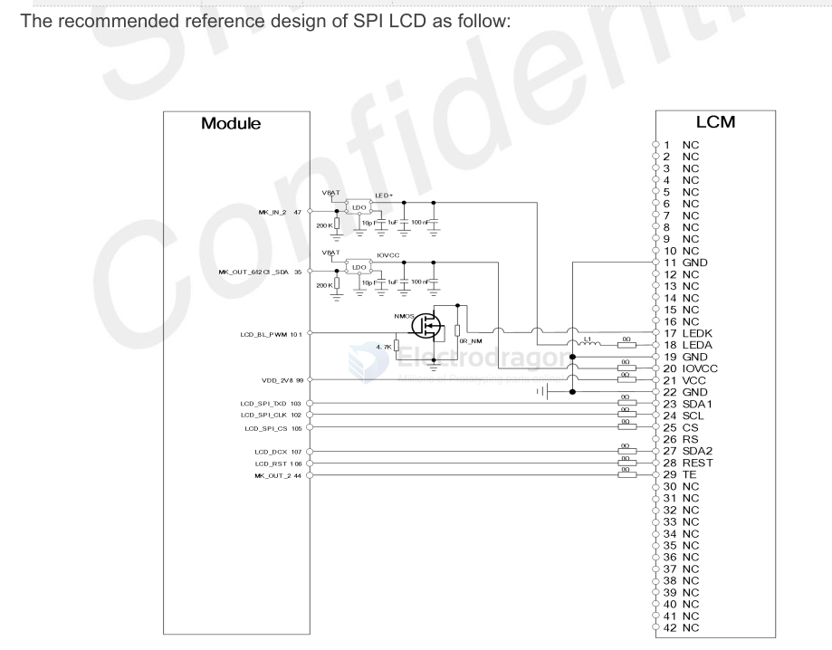
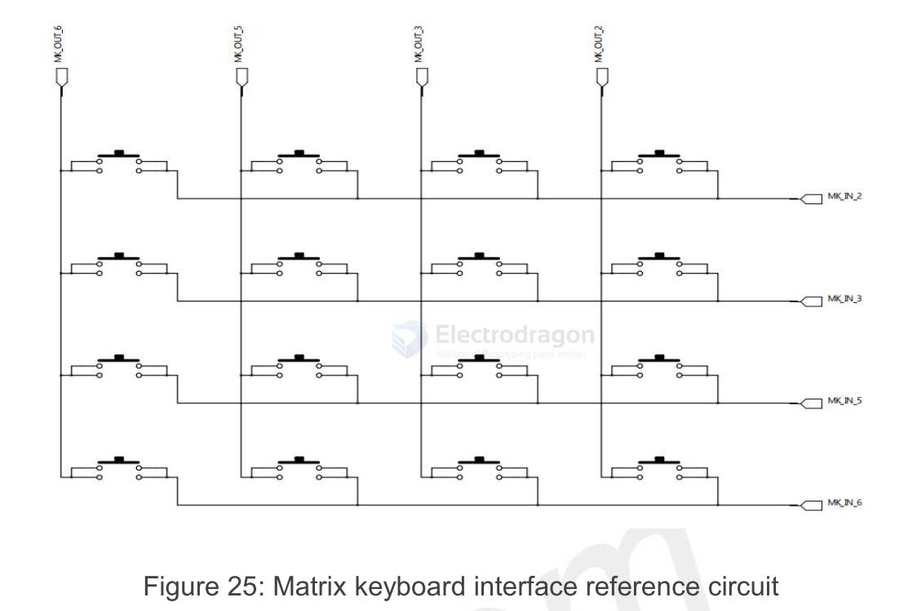
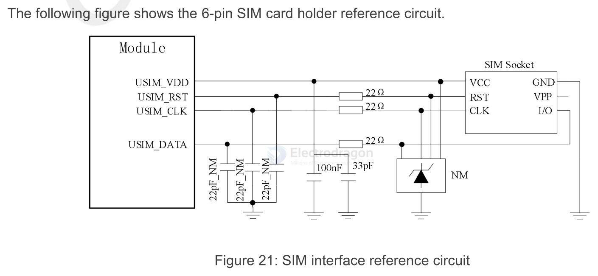
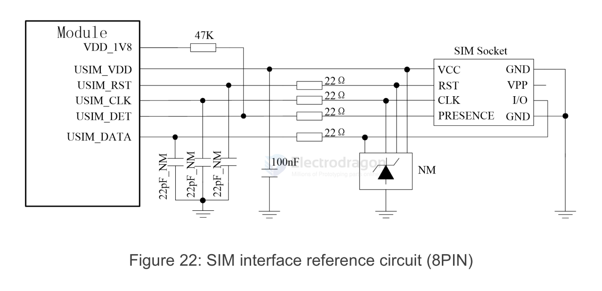
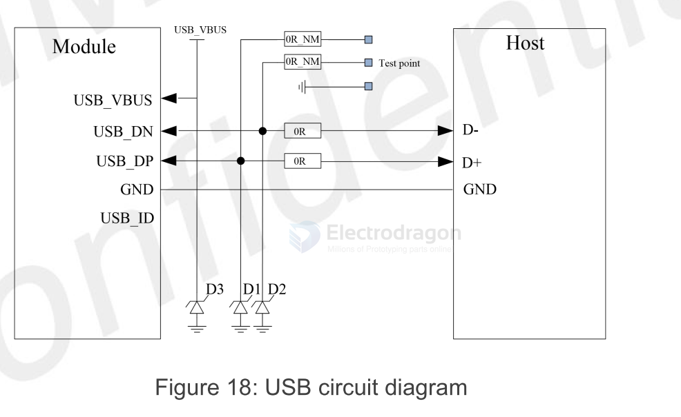
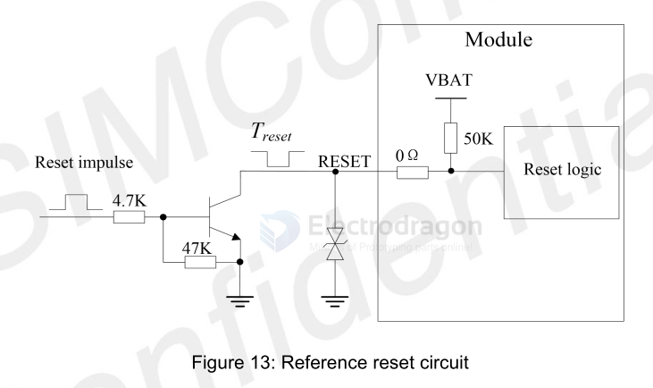
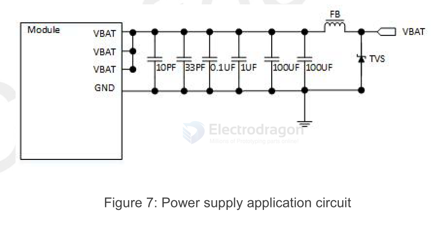

# M2M-HDK-Ref-dat

- [[M2M-HDK-Ref-dat]] - [[ref-design-dat]] - [[M2M-dat]] - [[M2M-HDK-dat]]

- [[VBAT-dat]] - [[VIN-dat]]

- [[ADC-dat]] - [[ADC-bat-monitor-dat]]

- [[M2M-HDK-dat]] - [[M2M-HDK-ref-dat]] - [[pwrkey-dat]]

- [[sensor-camera-dat]]

## Analog Audio 

### A7670 Based Ref 

- [[A7670-dat]]

## SPI LCD Interface 

## PCM 

- [[PCM-dat]]

## Matrix Keyboard Interface 

## SIM interface 

- [[SIM-dat]]

6-Pin SIM Card Interface

8-Pin SIM Card Interface

## M2M USB Reference 

- [[USB-dat]]

## Basic 

### reset 

### power supply 

## ref 

- [[MIC29302-dat]] - [[LM2596-dat]]

- [[M2M-dat]] - [[ref-design-dat]]