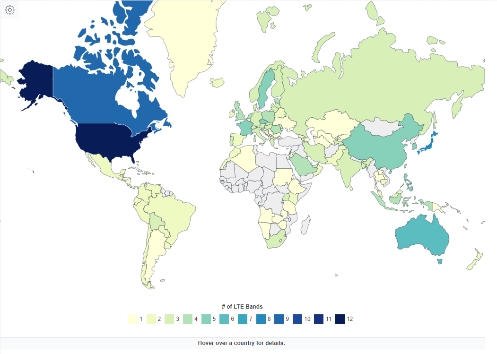
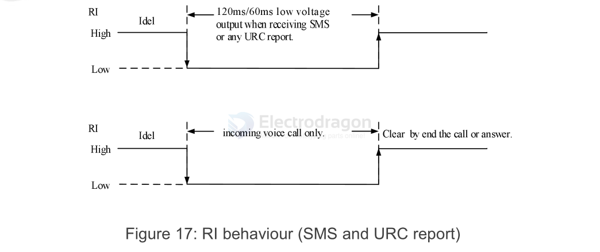

# M2M-dat

- [[M2M-HDK-Ref-dat]] - [[M2M-interface-dat]]

- [[LWPA-dat]] - [[NBIOT-dat]] - [[GPRS-dat]] - [[network-dat]]

- [[RTU-dat]] - [[DTU-dat]]

- [[A7670-dat]] - [[SIMCOM-dat]] - [[LTE-dat]] - [[M2M-dat]]

- [[M2M-dat]] - [[CAT-M-dat]] - [[CAT-NB-dat]] - [[SIMCOM-dat]] - [[SIM7080-dat]]

## Module manufacturer

- [[fibocom-dat]] - [[quectel-dat]]

- [[simcom-dat]] - [[SIM808-dat]]

## tech 

- [[M2M-dat]] - [[M2M-HDK-dat]] - [[M2M-HDK-ref-dat]] - [[M2M-HDK-debug-dat]]

- 2G
- LWPA

- [[LTE-dat]]
- CAT1
- CAT4
- [[NBIOT-dat]]

| LTE FDD                | LTE TDD |
| ---------------------- | ------- |
| B1/B3/B5/B8            |
| B1/B3/B5/B7/B8         |
| B1/B3/B5/B7/B8/B20/B28 |

LTE TDD B34/B38/B39/B40/B41

- Frequency-division duplexing (FDD); 
- time-division duplexing (TDD)

CAT-M
CAT-NB

## Tech by Types 

| Module        | Network    | Boards          |
| ------------- | ---------- | --------------- |
| [[A7670-dat]] | [[4G-dat]] | [[NGS1131-dat]] |
| [[EC20-dat]]  | [[4G-dat]] | [[NGS1108-dat]] |

## FDD vs TDD 

- https://en.wikipedia.org/wiki/LTE_frequency_bands
- TDD mainly located at 34 ~ 54

## Support 

- check supported countries by here: https://en.wikipedia.org/wiki/List_of_LTE_networks
- check by sepcific country: https://www.frequencycheck.com/countries
- interactive map: https://worldpopulationreview.com/country-rankings/lte-bands-by-country

## Functions 

LBS = Base station location, AT+CLBS 

### RI (ring) and DTR Behavior

RI usually keeps high level output. When receiving a short message or URC report, RI outputs a low level for 120ms (short message)/60ms (URC), and then returns to a high-level state; RI will output a low level, when receiving a phone call as the called party. 

After outputting low level, RI will remain low until the host accepts the call using the "ATA" command or the caller stops calling RI, in the end, it will become high level.

**DTR for sleep mode**

After setting the AT command “AT+CSCLK=1”, and then pulling up the DTR pin, Module will enter sleep mode when module is in idle mode. In sleep mode, the UART is unavailable. When A7672X/ enters sleep mode, pulling down DTR can wakeup module.

After setting the AT command “AT+CSCLK=0”, A7672X/A7670X Series will do nothing when the DTR pin is
pulling up.

### USB Interface

The A7672X/7670X contains a USB interface compliant with the USB2.0 specification as a peripheral, but does not support USB charging function and does not support USB HOST mode.

### GNSS 

GNSS_VBKP = GNSS VRTC power input, input voltage 1.4V~3.6V

| Pin name    | Pin No. | Power domain | Type | Description                                                           | Note                                                                           |
| ----------- | ------- | ------------ | ---- | --------------------------------------------------------------------- | ------------------------------------------------------------------------------ |
| GNSS_PWRCTL | 98      | 1.8V         | DI   | The enable control PIN ofGNSS power supply.                           | Active high.                                                                   |
| 1V8_GNSS    | 97      | -            | PI   | The power input for GNSS,the input voltage must notbe less than 1.8V. | Module VDD_1V8(PIN 15) can be usedfor this power supply                        |
| GNSS_VBKP   | 116     | -            | PI   | GNSS VRTC power input,input voltage 1.4V~3.6V                         | If unused, keep itopen.                                                        |
| 1PPS        | 100     | 1.8V         | DO   | 1PPS signal output                                                    | If unused, keep itopen.                                                        |
| GNSS_RXD    | 96      | 1.8V         | DI   | GNSS UART RX                                                          | Connect to MCUUART_TX;Or use 1K resistors inseries in moduleUART3_TX (pin 50). |
| GNSS_TXD    | 95      | 1.8V         | DO   | GNSS UART TX                                                          | Connect to MCUUART_RX;Or use 1K resistors inseries in moduleUART3_RX (pin 49). |

### NETLIGHT 

below table for A7670X 

Table 21: 2G mode NETLIGHT pin status

| NETLIGHT            pin status | Module status      |
| ------------------------------ | ------------------ |
| Always On                      | Searching Network  |
| 200ms ON, 200ms OFF            | Data Transmit      |
| 800ms ON, 800ms OFF            | Registered network |
| OFF                            | Power off / Sleep  |

Table 22: LTE mode NETLIGHT pin status

| NETLIGHT            pin status | Module status            |
| ------------------------------ | ------------------------ |
| Always On                      | Searching Network        |
| 200ms ON, 200ms OFF            | Data Transmit/Registered |
| OFF                            | Power off / Sleep        |

- [[SIM800-dat]]

## reference design 

- [[GNSS-dat]] - [[antenna-dat]] - [[SIM-dat]]

- [[diode-dat]] - [[dcdc-down-dat]] -

## ref 

- [[solutions-dat]]

- [[M2M]]