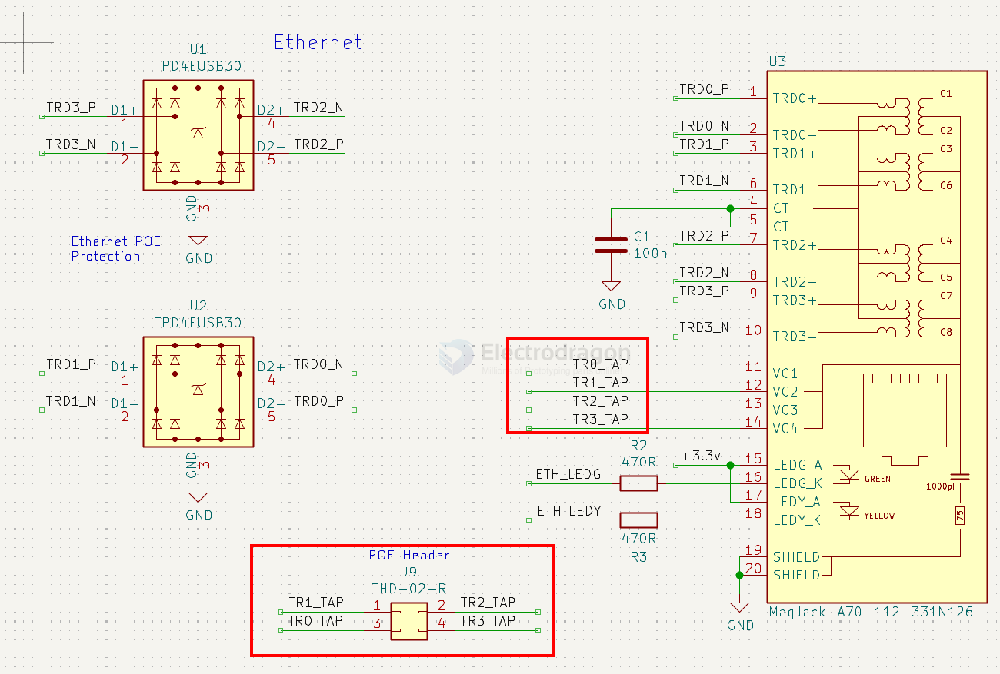
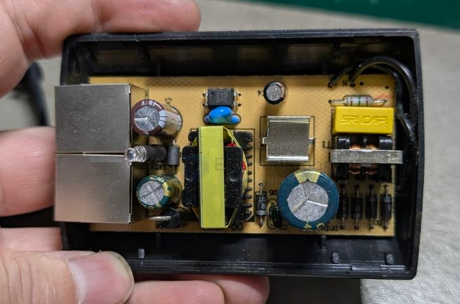
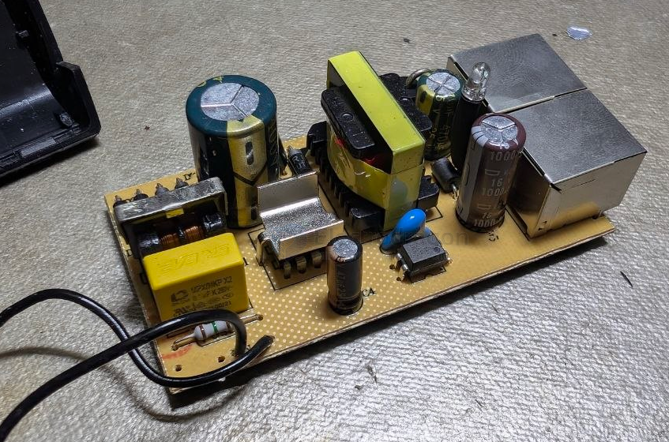
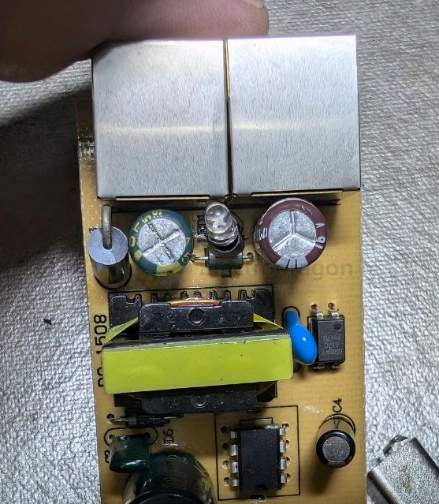
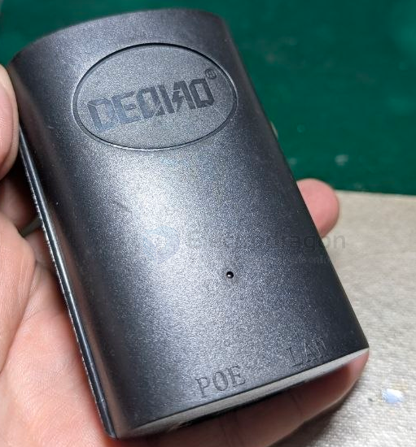
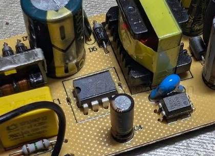
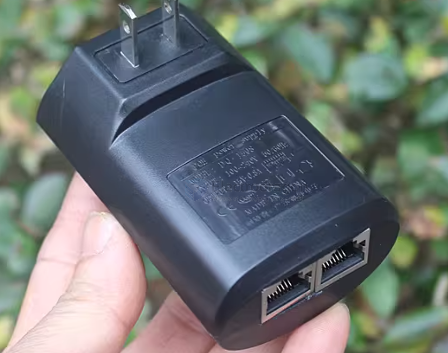

# POE-dat

- [[LAN-dat]]

# ESP32 POE / RS485 test 

- https://twitter.com/electro_phoenix/status/1639165025679212547

- https://x.com/electro_phoenix/status/1629048715637039104

- https://www.youtube.com/shorts/DEzd7XtT4Cw

- [[ESD-protection]]

## SCH 

- [[ethernet-dat]] 

- [[RJ45-dat]]

## deqiao dq-1508 POE module 

interface POE and LAN 

name scrapped chip 

output 15V 0.8A 

## ref 

- [[POE]]