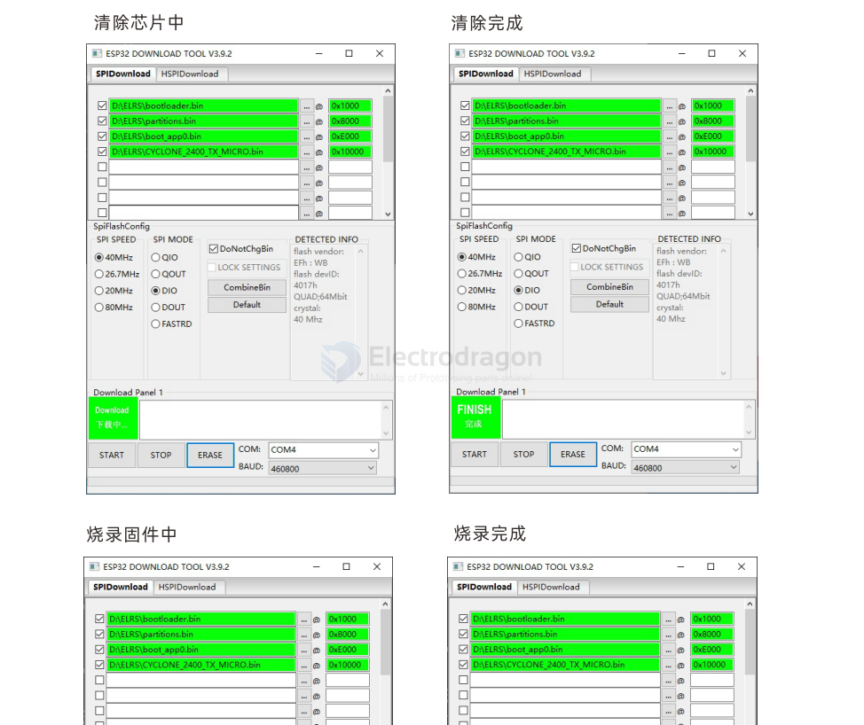

# ELRS-HF-RF-Module-dat

1.连接USB,高频头无需另外供电，第一次连接电脑如果你的系统是windows 10或以上并处于联网状态下，电脑会自动安装名为CH9102的USB-TTL驱动，刷写固件无需任何按键进入boot,刷写内置的，并且刷写内置Backpack也无需按任何按键和拨码开关,因为我们在内部设计了自动激活刷机模式电路与刷背包固件直通模式

## ref 

- [[ESP8266-dat]]